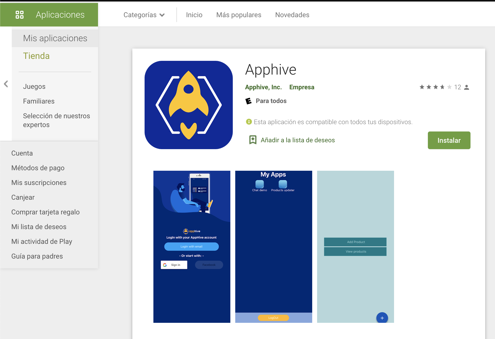

# Android App Preview

You can install the Apphive Android previewer from the Google Play Store \([https://play.google.com/store/apps/details?id=com.apphiverenderer](https://play.google.com/store/apps/details?id=com.apphiverenderer)\)


To preview your apps you need to login using the same credentials you use to create your account on the Apphive web editor


