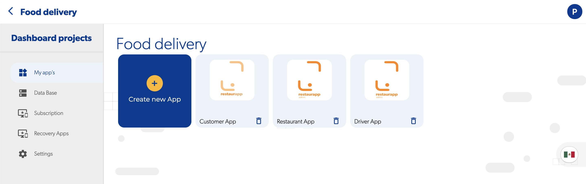

# 🆕 Creating a new project

### What is a project?

A project is a group of apps which share the same database and context, for example, if you want to create a food delivery app a project may contain three apps, the restaurant app, the user app and the driver app

### What are the configurations in a project?

The configuration of a project affects all the applications that are within it, the available configurations are:

* [Database](../reference/database/)
* [Subscription](../pricing/pricing.md)
* Geofire categories

