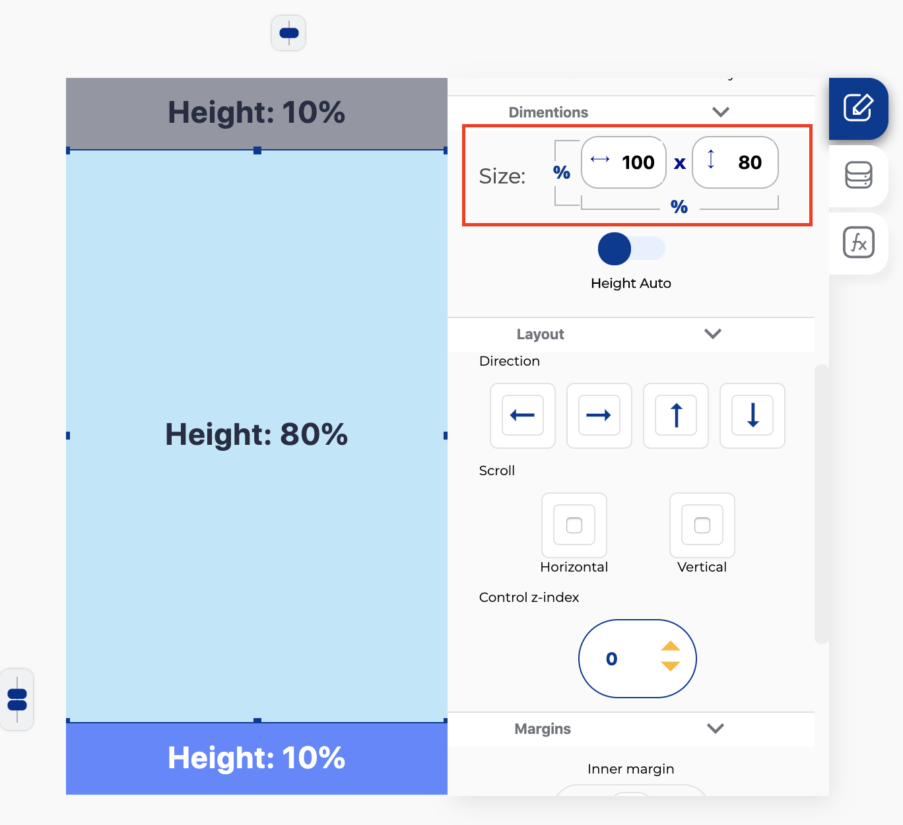
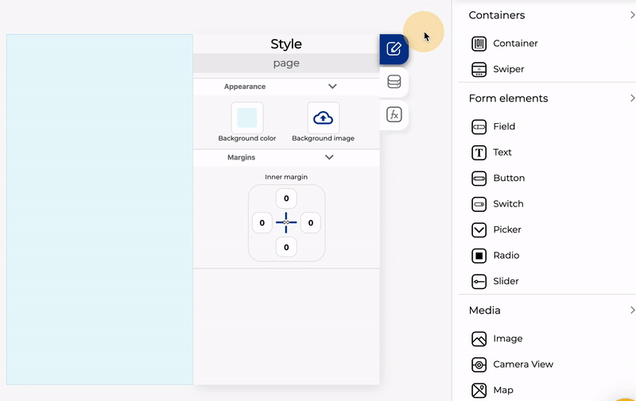

# Diseño responsivo

Para crear una aplicación receptiva, los primeros contenedores que agregue a una pantalla deben sumar el 100% de altura, por ejemplo:

Puede cambiar las dimensiones del contenedor seleccionando el contenedor y hacer clic en la pestaña de estilo

