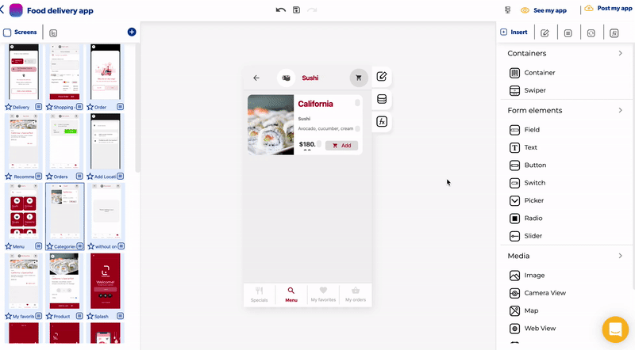
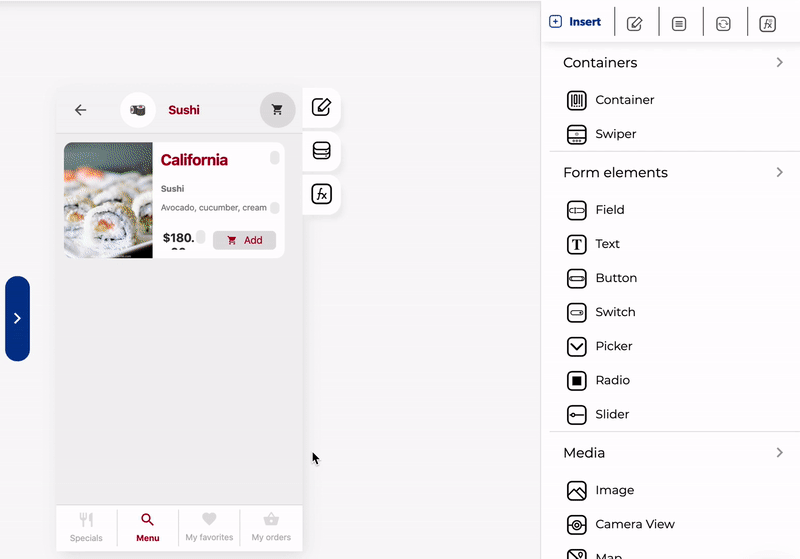

# Menu lateral

The sidebar is a control you can activate on any screen of your app, the content of the sidebar will be the same in all your app screens

### Activate the sidebar

To activate the sidebar just click on the "Left navigation bar" on the menu option you can find on the right sidebar:

### Add controls in a sidebar

You can add any control in a sidebar, once activated you need to open the sidebar and drag and drop any element you what to add

