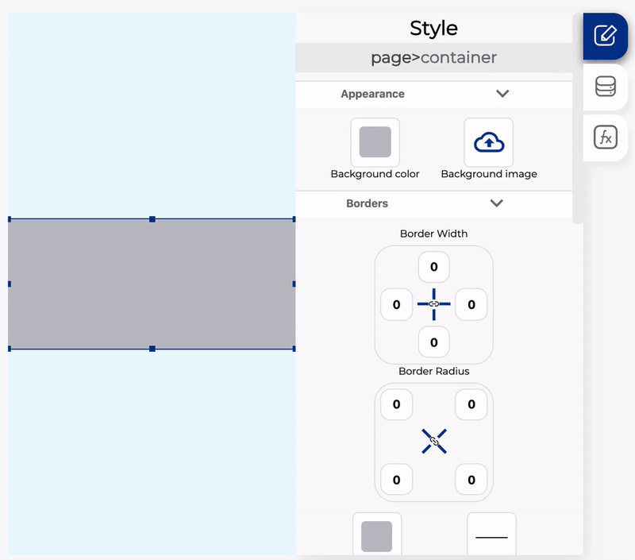
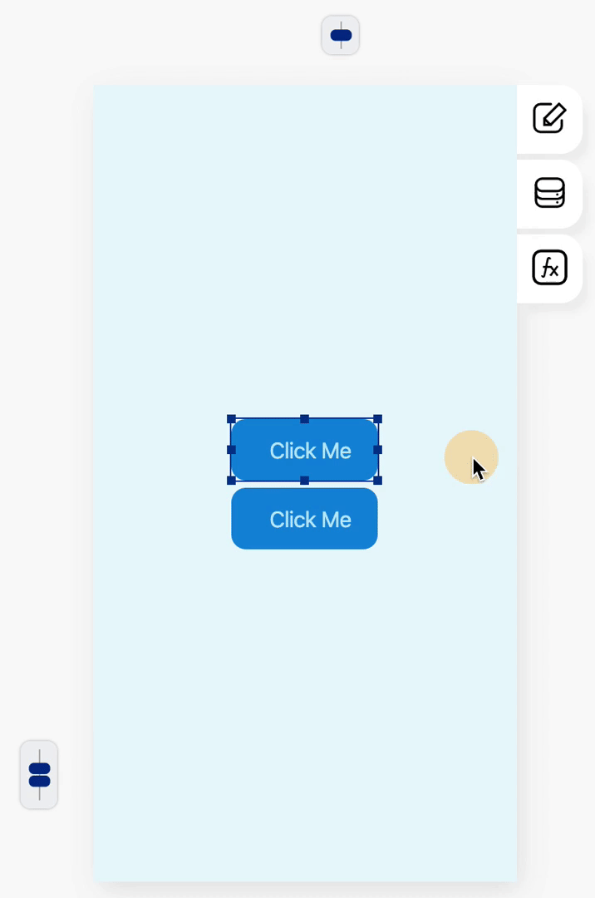
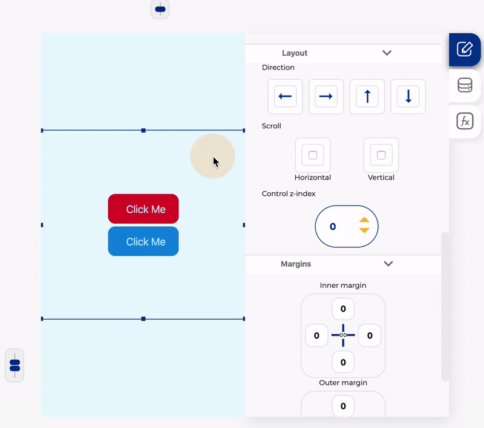

# Trabajar con contenedores

The container is one of the most important controls because it can help you order your content and create great designs.

You can add any other control inside a container even other containers

### Dividing the containers

You can split the container into different columns with different percentages on each one. To divide a container you need to select it and on the data tab select the number of columns you want or add the percents manually

### Align the elements inside a container

All the controls inside a container have the same align, and the same direction, you can change the alignment with the **align controls** at the top and left of the screen view, to change the alignment you need to select any control inside the container


If you selected scroll option on the control you can't change the alignment


You can also change the controls direction, to change the direction you need to select the container and then click on the style tab:

### Multiple alignments and directions using containers

As we see before the containers can just have a single direction and alignment and sometimes you need to add elements in more than one direction, to make it possible you can add a container inside a container to change the direction:

