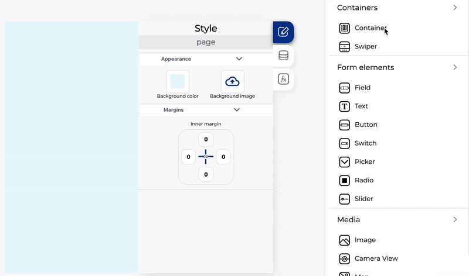

# Trabajar con contenedores

El contenedor es uno de los controles más importantes porque puede ayudarlo a ordenar su contenido y crear excelentes diseños..

Puede agregar cualquier otro control dentro de un contenedor, incluso otros contenedores

### Dividiendo los contenedores

Puede dividir el contenedor en diferentes columnas con diferentes porcentajes en cada una. Para dividir un contenedor, debe seleccionarlo y en la pestaña de datos seleccionar la cantidad de columnas que desea o agregar los porcentajes manualmente, recuerda que estos porcentajes deben sumar 100

### Alinear los elementos dentro de un contenedor

Todos los controles que estén dentro de un contenedor tienen la misma alineación y la misma dirección, puede cambiar la alineación con los controles de alineación en la parte superior e izquierda de la vista de la pantalla, para cambiar la alineación necesita seleccionar cualquier control dentro del contenedor


Si seleccionó la opción de desplazamiento en el control, no puede cambiar la alineación


También puede cambiar la dirección de los controles, para cambiar la dirección necesita seleccionar el contenedor y luego hacer clic en la pestaña de estilo:

### Múltiples alineaciones y direcciones usando contenedores.

Como vimos antes, los contenedores pueden tener una sola dirección y alineación y, a veces, es necesario agregar elementos en más de una dirección, para que sea posible, puede agregar un contenedor dentro de un contenedor para cambiar la dirección:

