# Request APK and AAB in Apphive

!!! note
    Recovered from the previous Apphive documentation. Some screenshots could not be recovered.

1.- Enter [https://editor.apphive.io ](https://editor.apphive.io/)and select your project

2.- Click on the Options icon and click on App dashboard

3.- Click on Compilations

4.- Click on the New Compilation button

5.- Select Android (Google Play) and click on Create request

6.- Add a compilation ID without typing Space, using the structure that is shown in the following picture, always separating between each one with a dot and with no spaces. **YOU DON’T NEED TO HAVE A WEB DOMAIN, DON’T WRITE**  **LOWERCASE LETTERS, ACCENTS, NUMBERS, OR PUNCTUATION SYMBOLS,**  **EXCEPT DOTS.**

Domain type: com, gov, edu, net, org, io, mx, etc. Name of your Firebase project: ubereatsplantillas Copy and paste, from the note or document, the NAME OF YOUR FIREBASE PROJECT and erase the spaces between each word, if any. Name of your app (the name your app is identified): plantillausuario, ubereatsusuario, appubereats. **IMPORTANT**  Copy the Compilation ID of your app and then paste it in your notes or a document as below: COMPILATION ID: com.ubereatsplantillas.plantillausuario After that, click on Assign Compilation ID

7.- Click on Pick Service Account file.

8.- Open the SERVICE ACCOUNT FILE folder, choose the .json file, and press Open

9.- Verify that the button changes to File Uploaded Successfully, and click on Next Step

10.- Copy from your notes or documents the FIREBASE REAL-TIME DATABASE URL, paste it on the box and click on Next Step.

11.- Copy from your notes or documents the FIREBASE STORAGE URL, paste it on the box and click on Next Step.

14.- Verify that you have enabled, in the “Authentication/sign-in method” section, Log in with your Firebase email, and click on Reload.

15.- Click on “Click here to get deployment token”.

16.- Choose your Gmail account

Important: You must log in with the same account you used to create your Firebase project

17.- Click on Allow

18.- Click on the Copy icon

19.- Paste it on the Cloud Deployment Token box, and click on Set Token

20.- Copy the SHA-1 from the box, click on Project Dashboard

21.- Click on Add a fingerprint

22.- Paste the SHA-1 in Certificate Fingerprint, click on Save.

23.- Go back and click on Next Step

**VERY IMPORTANT: THE FOLLOWING TEMPLATES CAN DISPLAY DEPENDING**  **ON THE FUNCTION YOU ADDED IN YOUR APP (LOGIN WITH WITH**  **FACEBOOK, LOGIN WITH GMAIL, START GEOLOCATION TRACKING, MAP**  **ELEMENT), AND YOU MUST COMPLETE THEM TO FINISH THE PROCESS OF**  **APK AND AAB REQUEST, THESE REQUIREMENTS WON’T DISAPPEAR, EVEN**  **IF YOU DELETE THE FUNCTION IN THE APP**

**SIGN IN GOOGLE METHOD**

1.- Click on Project Dashboard. Within your Firebase, check if you have enabled the Log In with Gmail function.

2.- Select “Google”, click on Activate, select your email and click on Save.

3.- Go back and click on Next Step

**SIGN IN FACEBOOK METHOD**

1.- Click on project dashboard, in your Firebase verify that you have enabled the login with Facebook

2.- Click on Next step

3.- Copy the FACEBOOK APP ID from your note or word and paste it into your box, then copy the FACEBOOK SECRET KEY from your note or word and paste it into your box

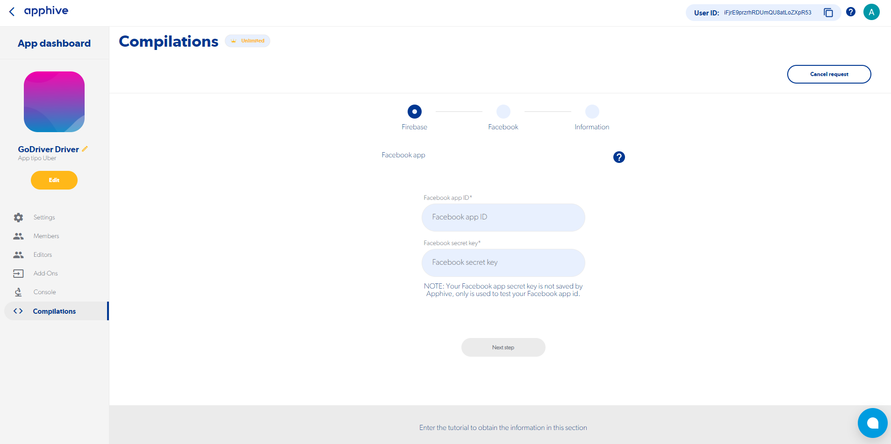

4.- Click on Next step

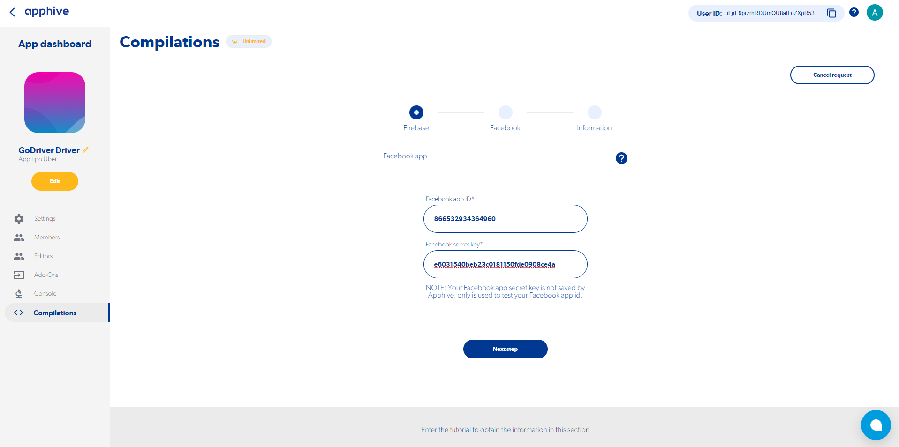

5.- Click on Facebook app dashboard

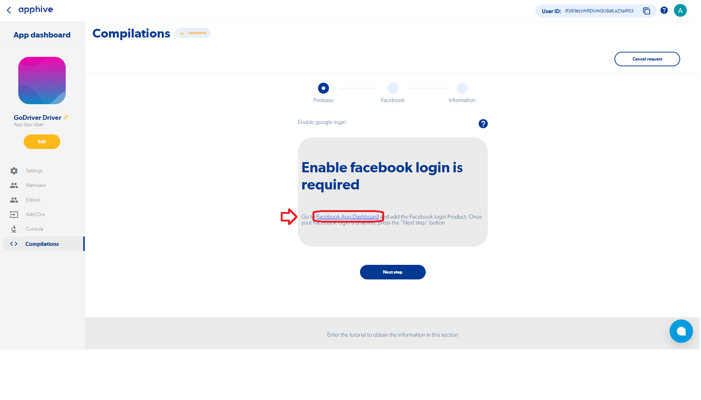

6.- Click on Configure in Login with Facebook.

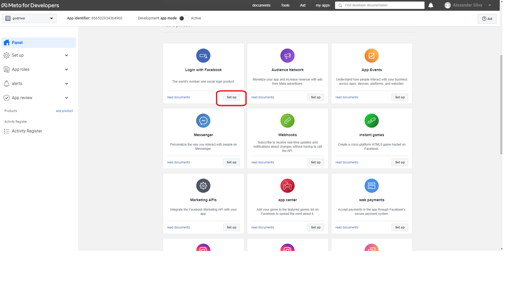

7.- Click on Android.

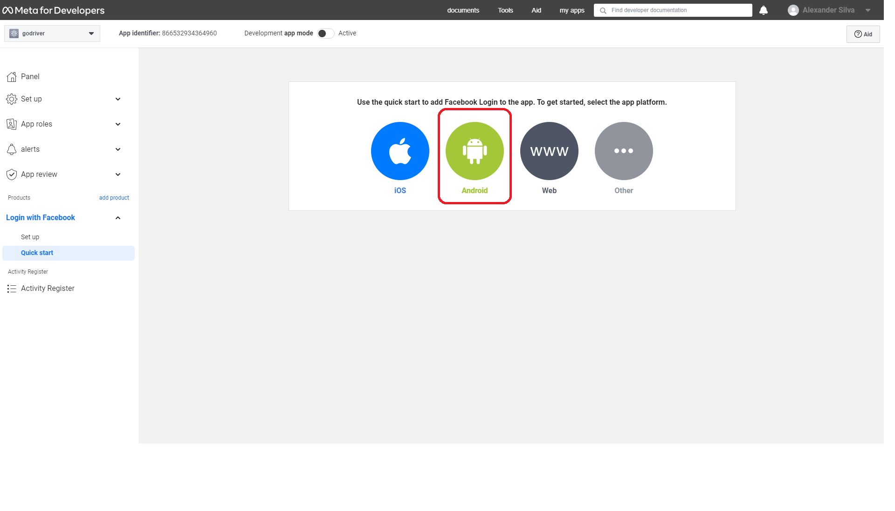

8.- Click on next step

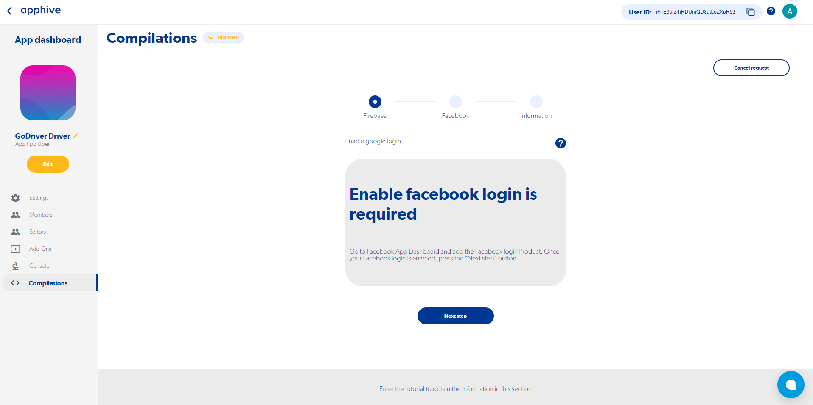

9.- Click on Facebook app dashboard

10.- Click on the Android icon.

11.- Click on next.

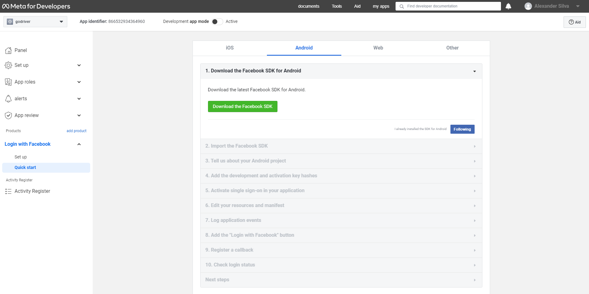

12.- Click on next.

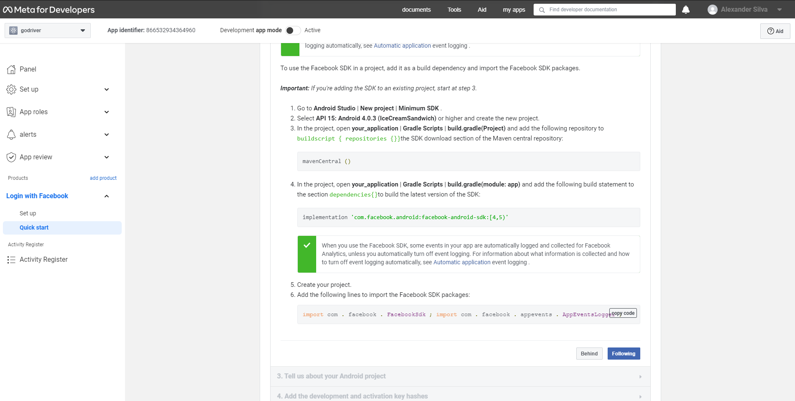

14.- Paste the Android package name in Package name, type MainActivity (with the exact same capitalization and no spaces) and click Save

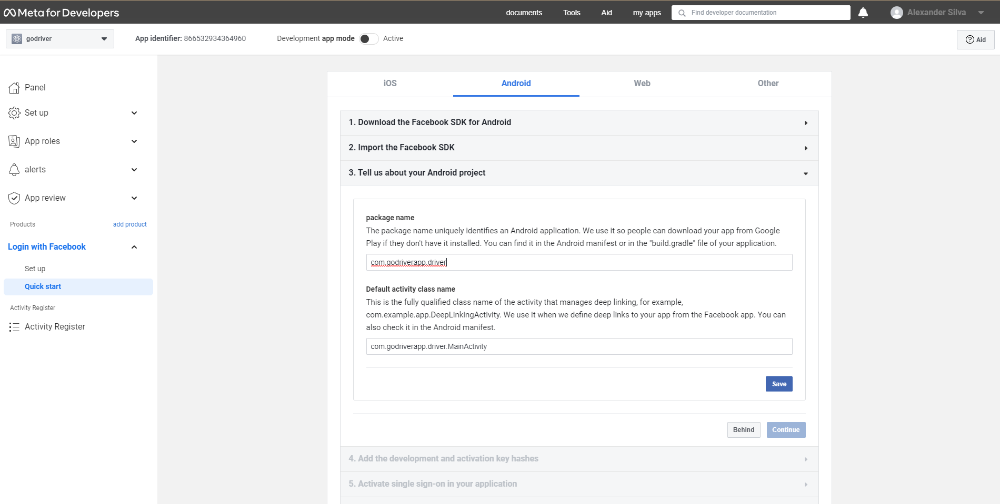

15.- Click on continue.

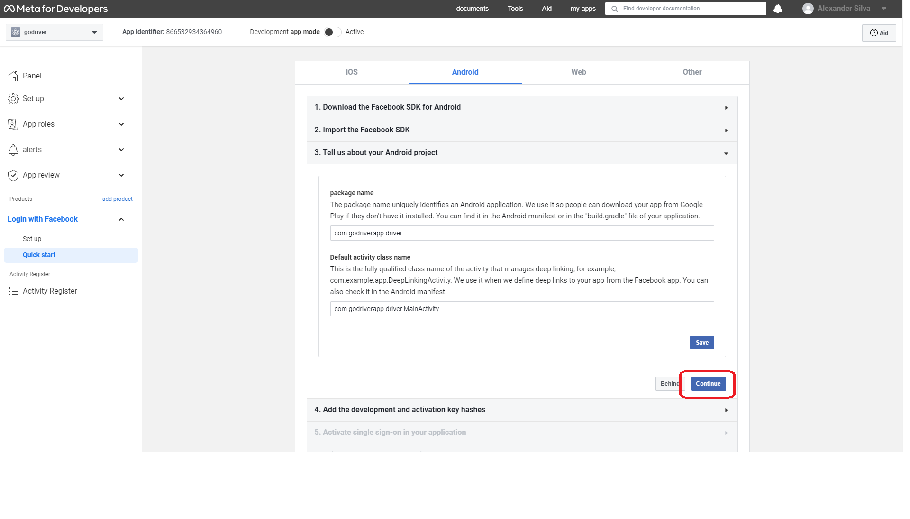

17.- Paste the Release key hash in Key Hashes, select the key hash in blue and click save

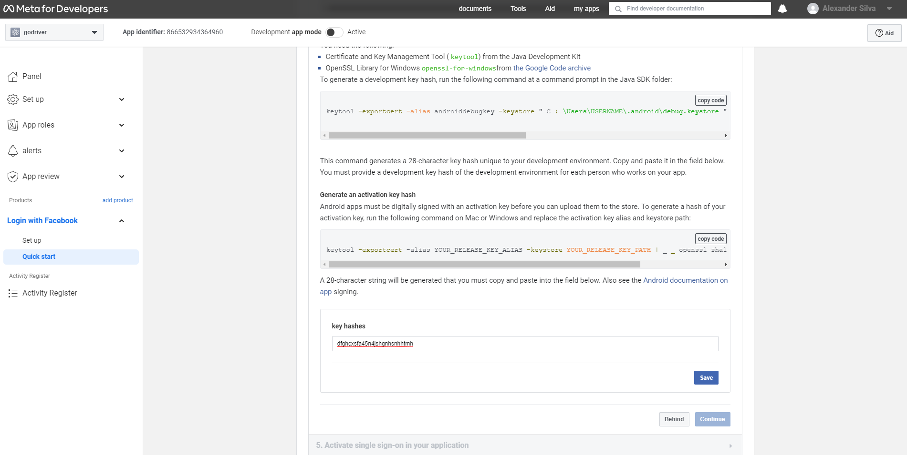

19.- Click to activate the Single Sign On switch, click Save and Next.

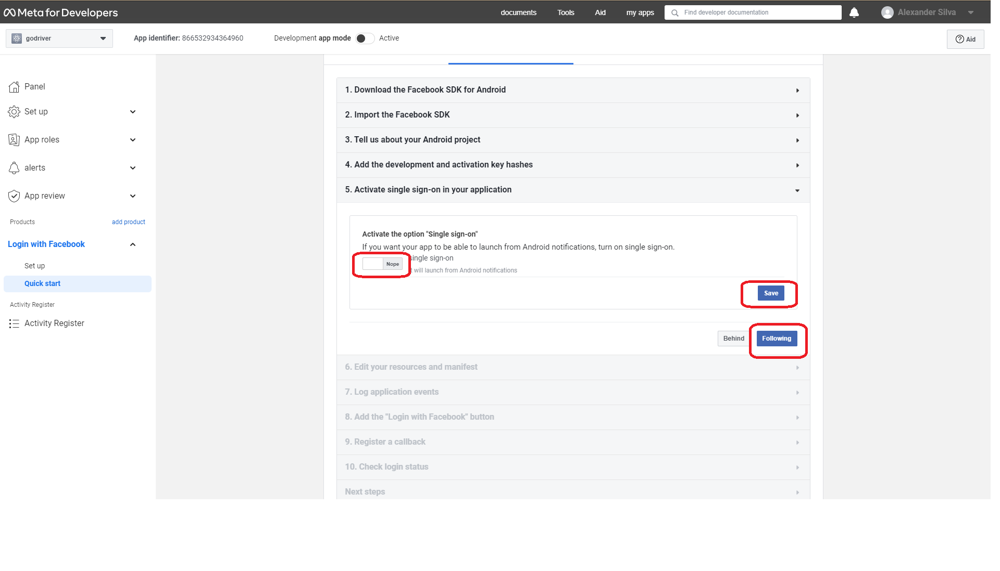

**GOOGLE MAPS KEY**

1.- Paste your Google API Key in the marked box, then click on Next Step

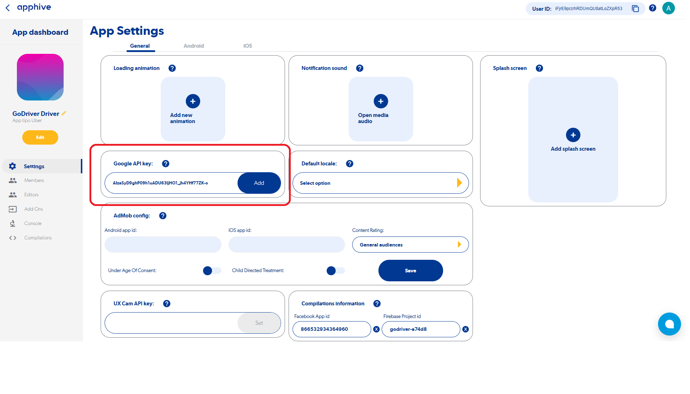

*In case you need to get your Google API Key
