# Facebook for developers

1.- Go to https://developers.facebook.com/ 146 and click on login

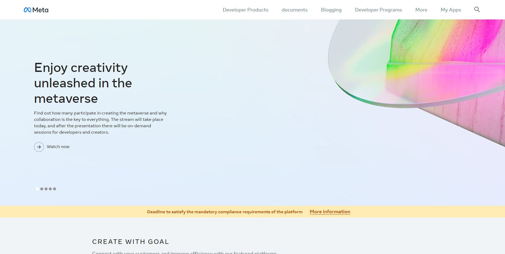

2.- Log in with your Facebook account by typing your username and password, click on Login

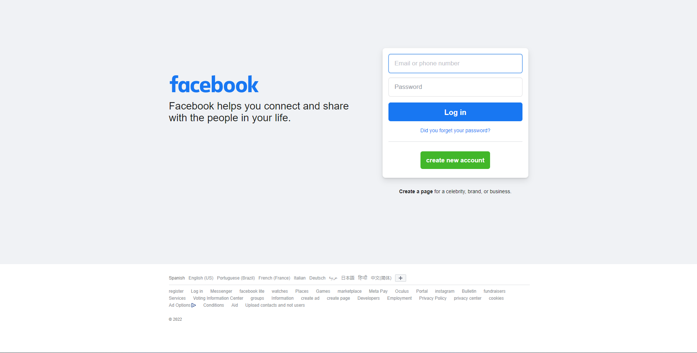

3.- Click on My apps.

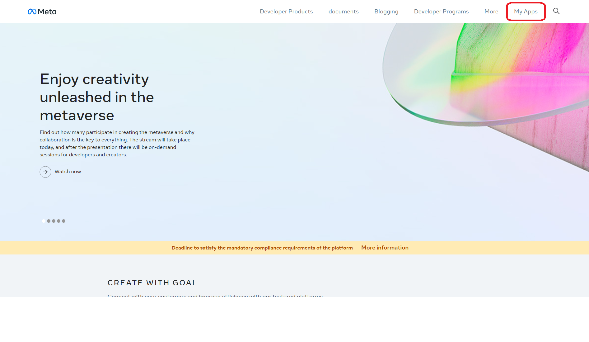

4.- Click on Create app and select the option for everything else, if this option does not appear, select Create connected experiences.

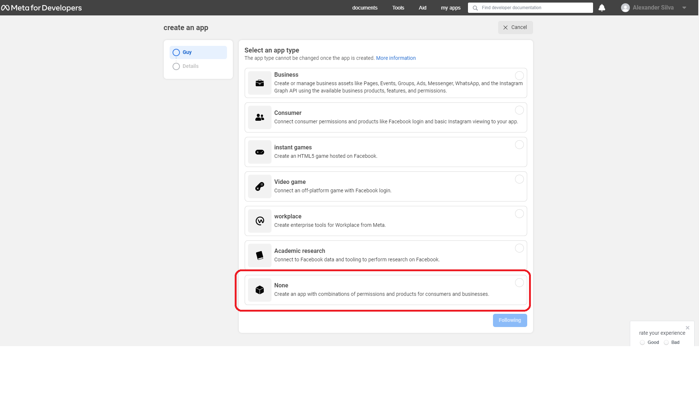

5.- Add the same name of your Firebase project in the App's display name, add the same email with which you created your Firebase project so that they notify you if there is a problem in your Facebook app, give Click Create App Identifier.

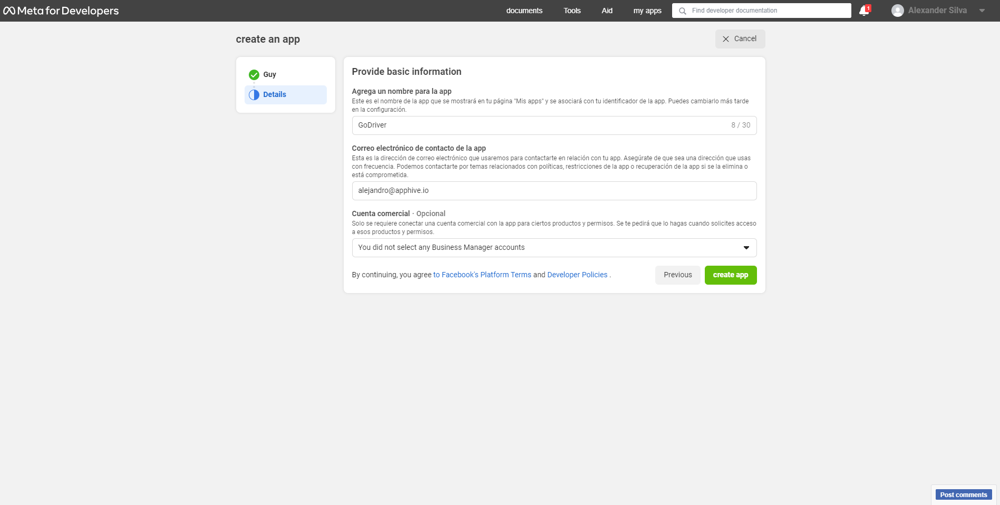

6.- Click on the box I am not a robot and click on Send

7.- VERY IMPORTANT You must copy the App Identifier and paste it into a note or a word document as follows:

FACEBOOK APP ID: 323163702315837

Then click on Settings and select Basic.

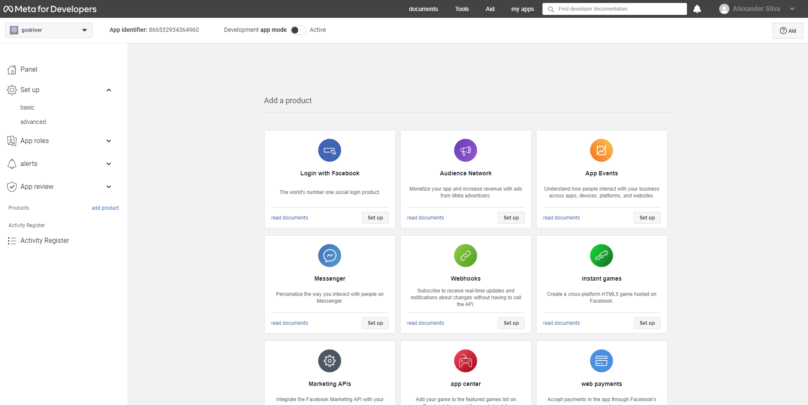

8.- Click on Show.

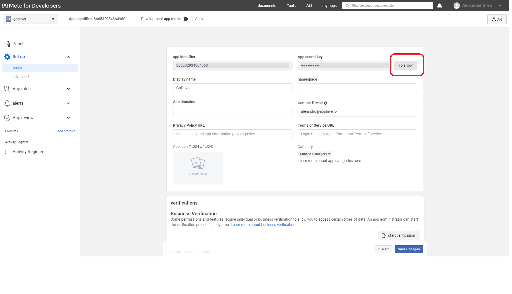

9.- Enter the password of your Facebook account

VERY IMPORTANT Copy the secret Key of the app and paste it into a note or a word document as follows:

FACEBOOK SECRET KEY: c1e49a520c59a76f2351d90c664edf63

10.- Open Firebase https://firebase.google.com 12 and click Go to console.

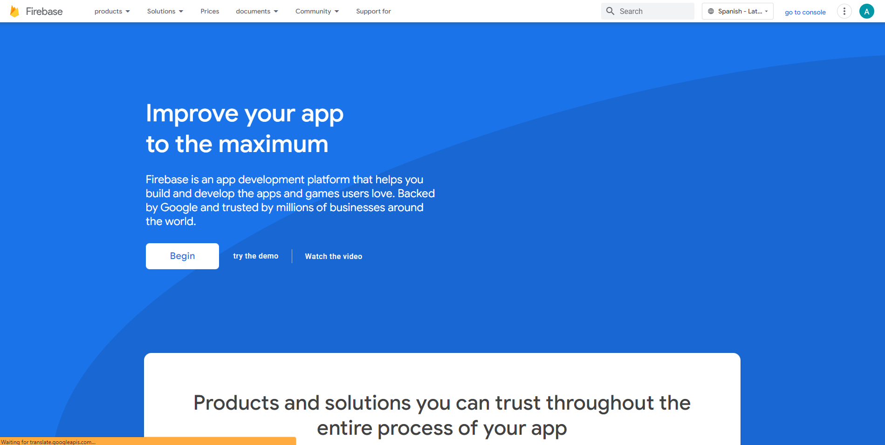

11.- Click on your Firebase project.

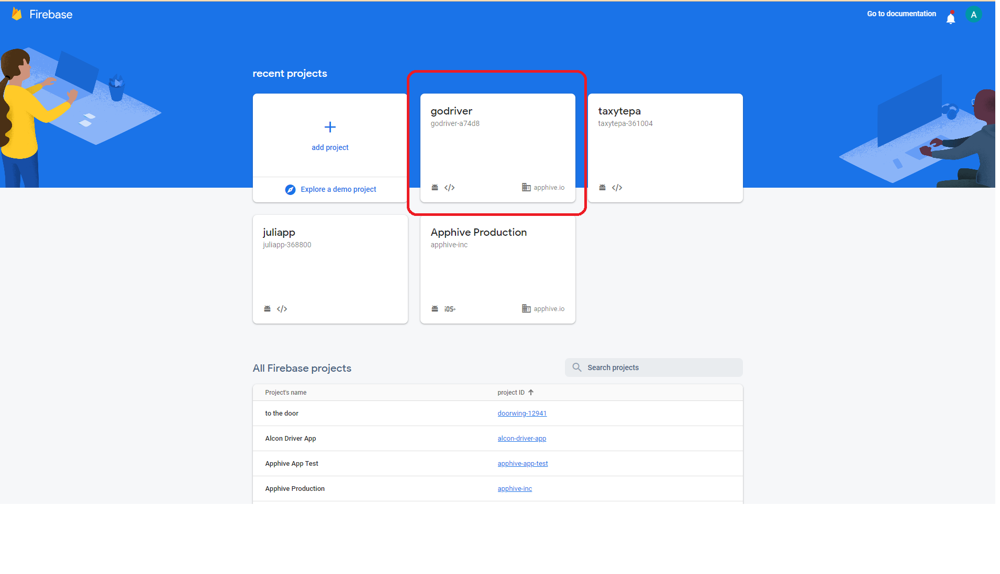

12.- Select Authentication and click on Sign-in method.

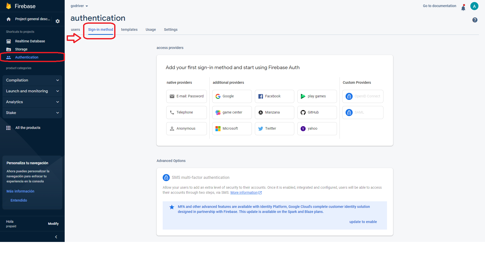

13.- Select Facebook, click enable, copy the FACEBOOK APP ID from your note or word document and paste it in App ID and copy the FACEBOOK SECRET KEY and paste it in the App Secret, click Enable and Save.

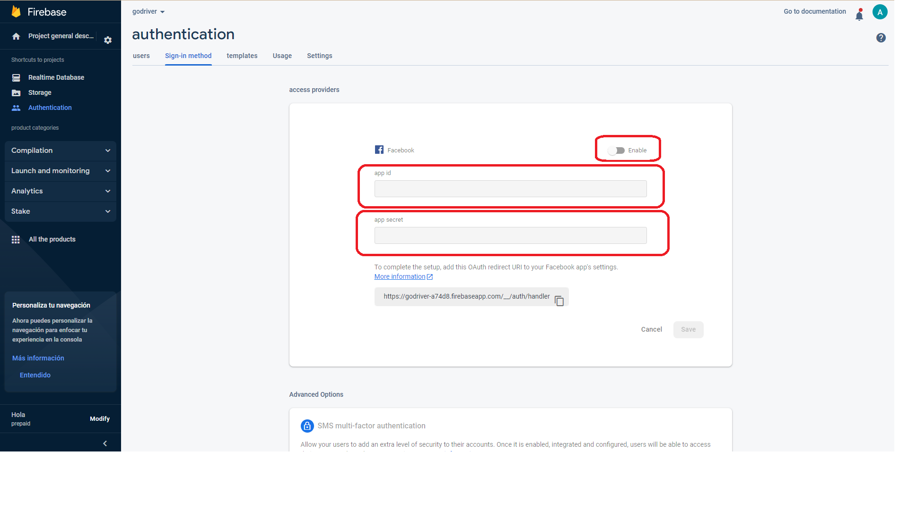

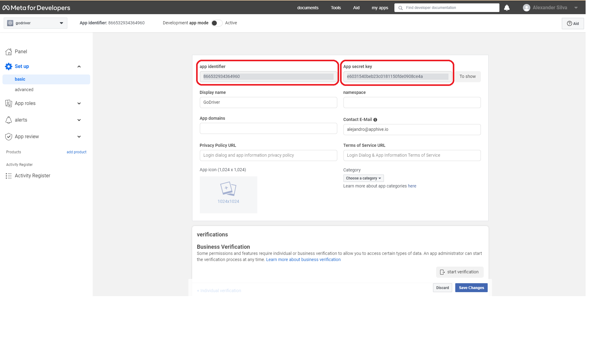

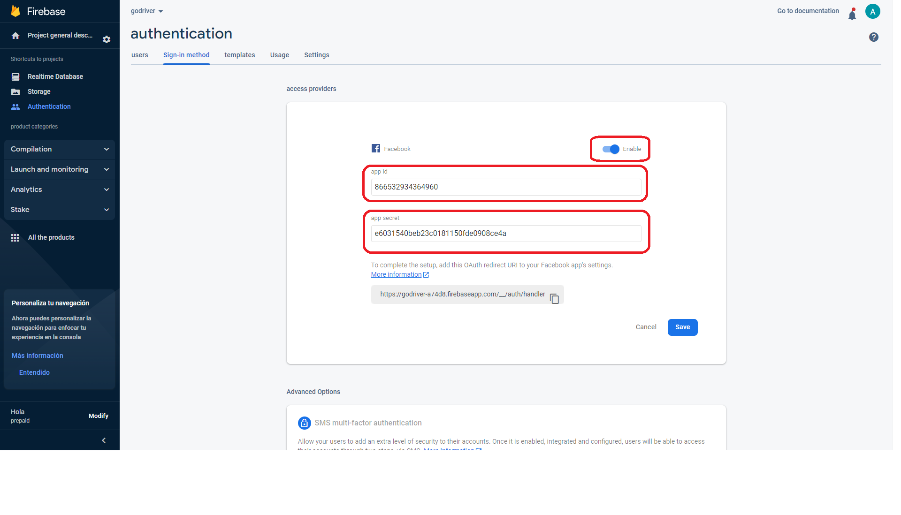
