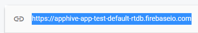
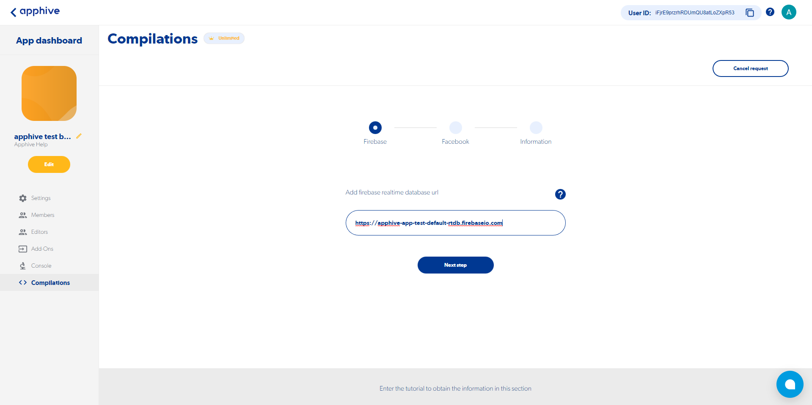

# Get the Realtime Database URL

!!! note
    Recovered from the previous Apphive documentation. Some screenshots could not be recovered.

Step 1.- Select Realtime Database and click on **“Create a database”**

Step 2.- Select Start in locked mode and click on **"Enable"**

Step 3: Select the option for the area where you want to have your server (recommendation: keep the default option) and click on **"Following"**

Step 4.- Select the URL as below, it’s important to note this info, as it will be requested to generate your compilation.

Example of a Firebase Realtime Database URL: `https://your-project-default-rtdb.firebaseio.com`

Step 5: Copy the complete URL of your database and paste it when prompted to do so during the compilation process.

