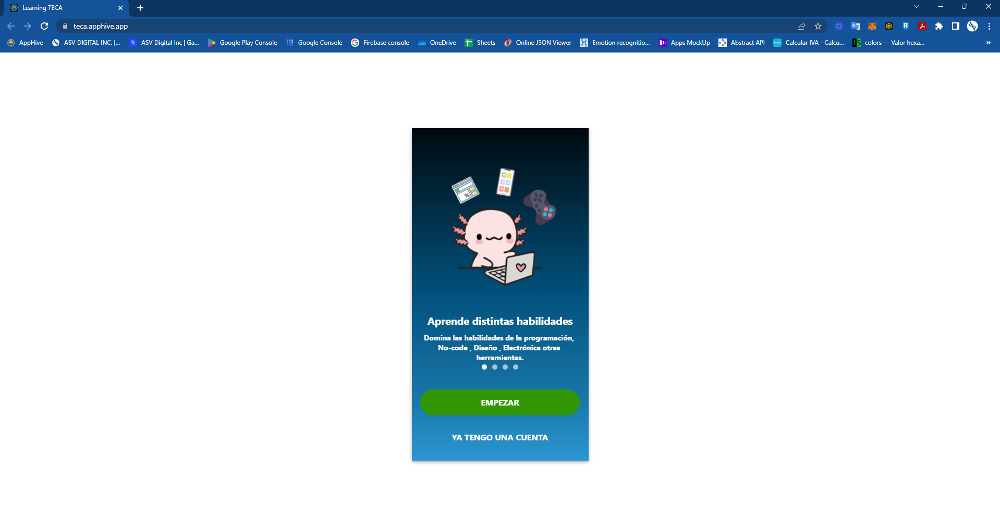
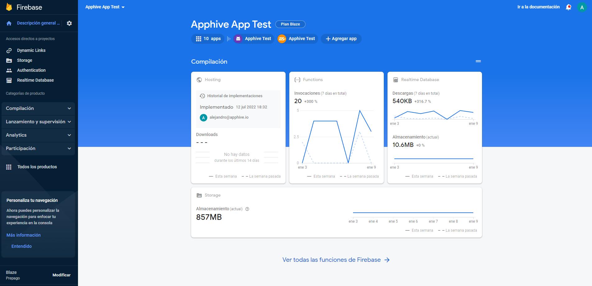
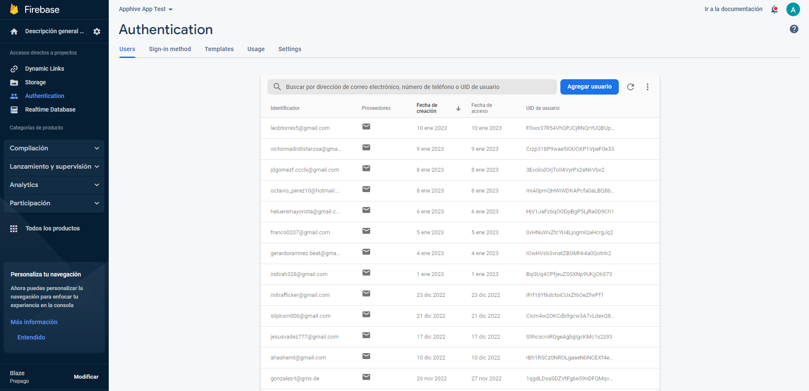
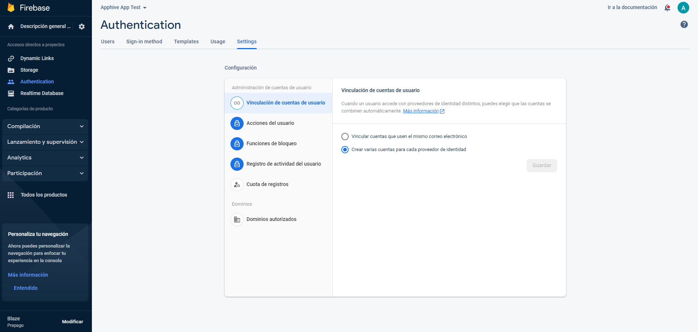
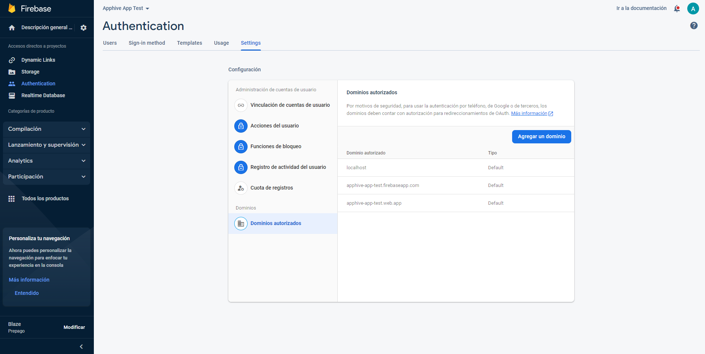
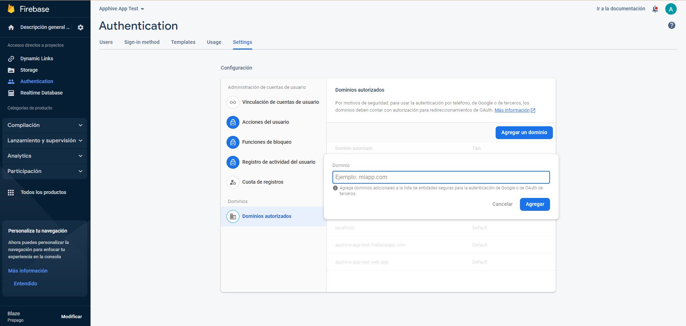
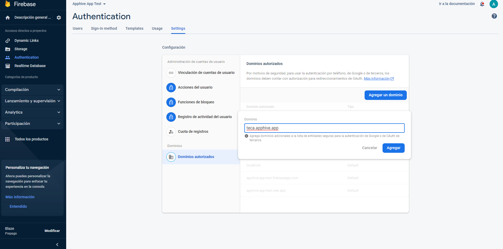

# Login with Google in your web app

1.-To enable login with Google in your web application, you first need to copy the URL of your application.

2.-Navigate to the Firebase console and log in to your project.

3.-Access the Authentication section

4.-Select the settings option in the sub-menu

5.-Select authorized domains.

6.-Click on the option to add a domain.

7.-Finally, enter the domain of your web app and click on "Add". With this step we will be completing the process and you will be able to sign in with Google within your web app.

