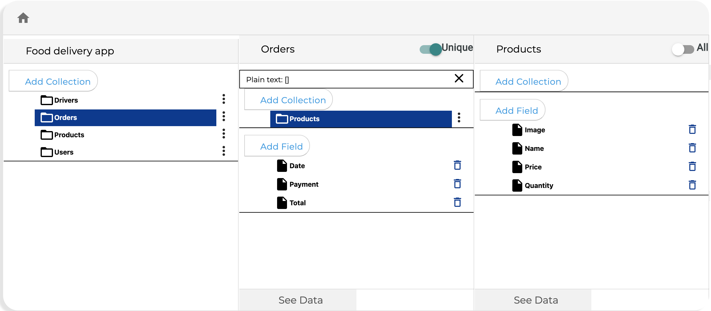

# Database Editor

The database editor allows you to define the structure of your data as well as add, delete, view and export information from the database

[Open Database Editor](open-database-editor.md)

[View Data](view-data.md)

[Add Data](add-data.md)

[Edit Data](edit-data.md)

[Delete Data](delete-data.md)

[Export Database Data](export-database-data.md)

[View Data Nested Collections](view-data-nested-collections.md)

