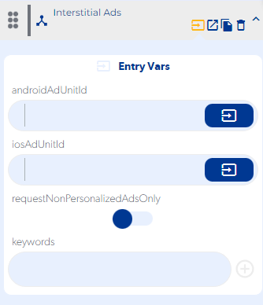

# Interstitial Ads

### Entry Vars

**androidAdUnitId :** You must enter the id of the ad to display on android devices.

**iosAdUnitId :** You must enter the id of the ad to display on android devices.

**requestNonPersonalizedAdsOnly :** It should be activated when personalized ad campaigns should be shown.

**keywords :** Keywords must be entered to display personalized ads.

**Step by Step :**

### Callbacks & Outvar

**On Error :** Fires when the ad is not displayed due to an invalid ad id or connection error.

OutVars

`Null`

**On Loaded :**  It is executed when the displayed ad is loading.

OutVars

`Null`

**On Opened :** It is executed when the ad is displayed on the screen to the user.

OutVars

`Null`

**On Clicked :**  It is executed when the displayed ad is pressed by the user.

OutVars

`Null`

**On Left Application :** Runs when coming from another app.

OutVars

`Null`

**On Closed :** It is executed when the displayed ad is closed by the user.

OutVars

`Null`
