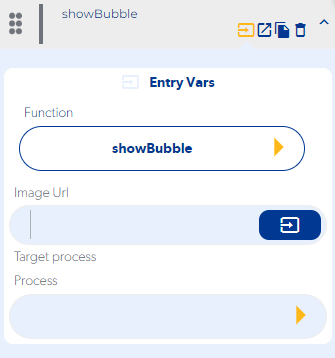
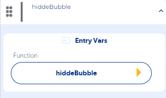
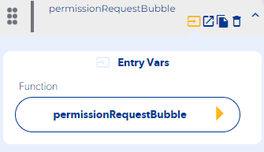
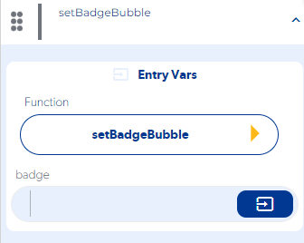

# Bubble

### showBubble

### Entry Vars

**Image Url :**  The (URL) storage address of the image to be placed is placed.**(Requerida)**

**Target process / Process :** The appProcces that will be executed when pressing the Bubble is selected.**(Requerida)**

### Callbacks & OutVars

**onError :**

OutVars

`Null`

**onSuccess :**

OutVars

`Null`

### hiddeBubble

### Entry Vars

**(Does not contain Entry Vars)**

**Step by Step :**

### Callbacks & OutVars

**onError :**

OutVars

`Null`

**onSuccess :**

OutVars

`Null`

### permissionRequestBubble

### Entry Vars

**(Does not contain Entry Vars)**

**Step by Step :**

### Callbacks & OutVars

**onError :**

OutVars

`Null`

**onSuccess :**

OutVars

`Null`

### setBadgeBubble

### Entry Vars

**badge :** The value to show in the bubble badge is sent**. (required)**

**Step by Step :**

### Callbacks & OutVars

**onError :**

OutVars

`Null`

**onSuccess :**

OutVars

`Null`
