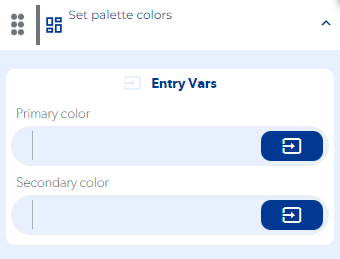
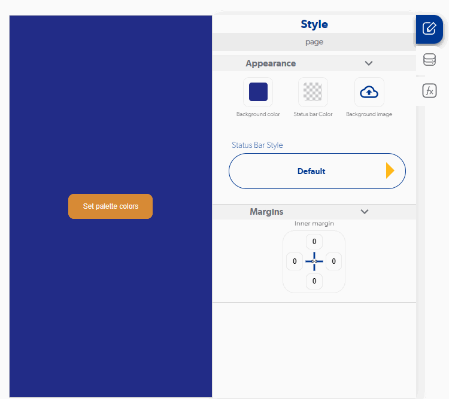

# Set palette colors

### Entry Vars

**Primary color:**  Enter the primary color code (from Color Value located in the Control Table)**(Required)**

**Secondary color:** Enter the color of the secondary color (from Color Value located in the Control Table)**(Required)**

**Step by Step :**

### Callbacks & Outvar

**On error :** It is executed when the entered colors are not valid

OutVars

**On Suceess :** Runs on successful color palette update.

OutVars

### Features

No se puede agregar de forma directa los coódigos de los colores, ya que no los reconoceria, se tienen que agregar directamente desde la Tabla de controles en la sección de Color Value. Si se selecciona "custom:transparent" se acepará cómo color valido, pero se verá reflejado como un color negro

### examples

