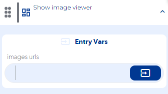
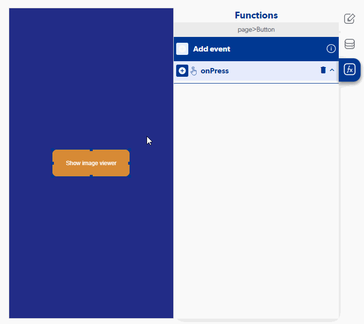

# Show image viewer

Show image viewer (vista ejemplo)

### Entry Vars

**Images urls:** Enter the URL of the image(s) you want to display, if there are more than one, they must be sent as an array. (required)

**Step by Step :**

### Callbacks & OutVars

**onError:** Fired when the image(s) are not in the correct format.

OutVars

`invalid url, should be an array of strings or an string`

### Features

**Conjunto de imágenes:**  Para poder visualizar un conjunto de imágenes, se tiene que ingresar un arreglo (array) de URLs de imágenes. Para poder realizar el arreglo de imágenes, ayudate de la función **Array from object** **. Cerrar visualizador:**  Para cerrar la vista, presiona en la "**X** " ubicada en la parte superior derecha o simplemente arrastra la imagen hacia la parte inferior de tu pantalla **Zoom:**  Para realizar zoom a tus imágenes, arrastra la imagen hacia extremos contrarios con dos dedos

### examples

