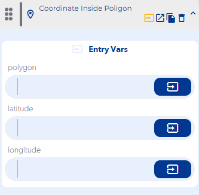

# Coordinate Inside Poligon

### Entry Vars

**polygon :**

**latitude :**

**longitude :**

**Step by Step :**

### Callbacks & Outvar

**On Error :**

OutVars

`Null`

**On Inside :**

OutVars

`Null`

**On Out Of :**

OutVars

`Null`
