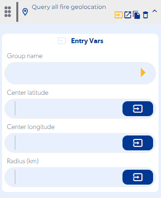

# Query all fire geolocation

### Entry Vars

**Group name :** A group must be selected.

**Center latitude :** A reference latitude must be entered as a starting point.

**Center longitude :** A reference longitude must be entered as a starting point.

**Radius (km) :** You must enter a numerical value that will indicate the radius that the search will cover.

**Step by Step :**

### Callbacks & Outvar

**Error at get location :** Runs when you don't have a connection.

OutVars

`Null`

**No data found :** Executed when no records are found within the search group.

OutVars

`Null`

**Success at get location :** Executed when it returns all the records within the search group.

OutVars

`Null`
