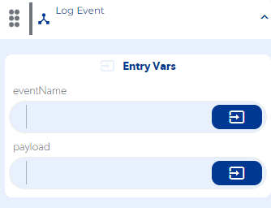

# Log Event

### First Tab

**eventName :** You must enter the name that we will give to our event.

**payload :** Information must be entered that we want to store or save in our event.

**Step by Step :**

### Second Tab

**On Error :** Se ejecuta al ingresar un dato invalido o no almacenamos información en nuestro evento.

OutVars

`Null`

**On Success :** Se ejecuta en cuanto se registre nuestro evento con la información ingresada.

OutVars

`Null`
