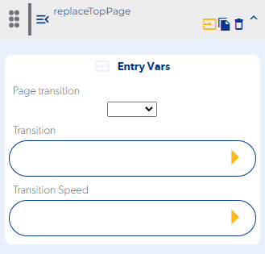

# replaceTopPage

### Entry Vars

**Page transition :** Select the screen of your application that you want to access

**Transition :** Select the type of animation with which the replace next screen will be displayed. (optional)

**Transition Speed :** Select the speed of the animation with which the replace next screen will be displayed. (optional)

**Step by Step :**

### Callbacks & OutVars

**(No contiene callbacks)**

OutVars:

 If a landing page is not selected, it will display an error message

` "[pushPage] INVALID TARGET PAGE"`

If the landing page was removed from the application, a message with the following error will be displayed

`"[pushPage] INVALID TARGET PAGE *ID_PAGE*"`
