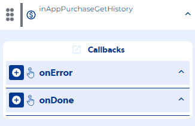

# inAppPurchaseGetHistory

### Entry Vars

**(Does not contain Entry Vars)**

**Step by Step :**

### Callbacks & OutVars

**onError :** It runs when there is no internet connection.

OutVars

`Null`

**onDone :** It is executed when it returns us our sales history.

OutVars

`Null`
