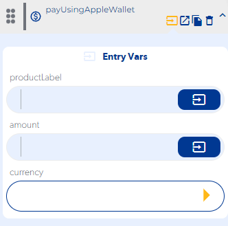

# payUsingAppleWallet

### Entry Vars

**productLabel :**  Name or label must be entered to identify the product.

**amount :**  The amount to be paid must be entered using Apple Wallet.

**currency :**  The type of currency must be entered to pay using Apple Wallet.

**Step by Step :**

### Callbacks & OutVars

**onError :** It is executed when the payment is cancelled.

OutVars

`Null`

**onUnableToMakeApplePayment :**

OutVars

`Null`

**onCanceled :** It is executed when the payment is cancelled.

OutVars

`Null`

**onCompleted :** It is executed when the payment is successful.

OutVars

`Null`
