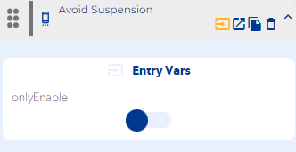
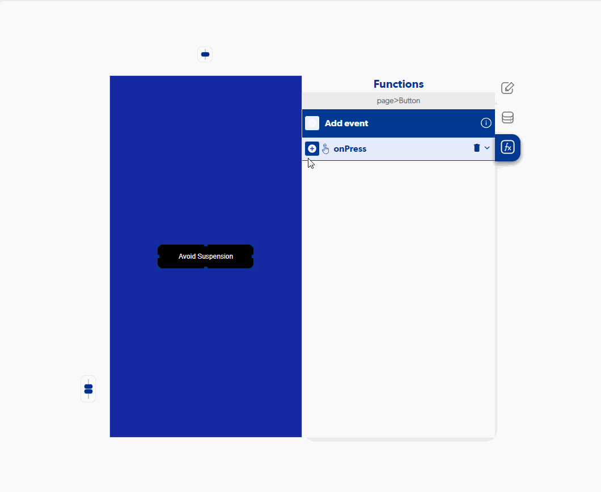

# Avoid Suspension

### Entry Vars

**onlyEnable :**

**Step by Step :**

### Callbacks & Outvar

**On Error :** Runs when our function can't prevent screen sleep.

OutVars

`Null`

**On Success :** Runs when our function executes successfully and prevents screen sleep

OutVars

`Null`
