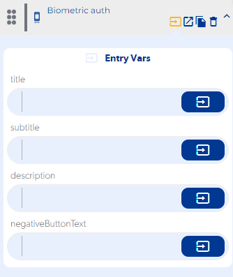
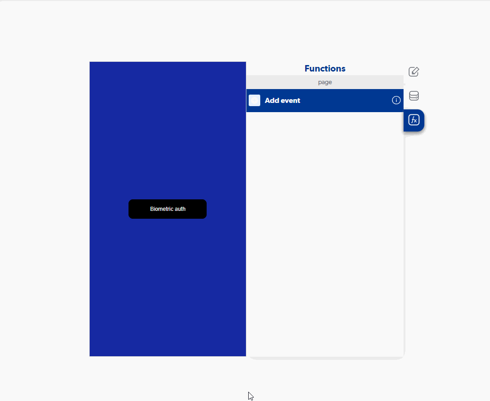

# Biometric auth

### Entry Vars

**title :** You must enter the title that will be displayed when requesting permissions from the user.

**subtitle :** You must enter the subtitle that will be displayed when requesting permissions from the user.

**description :** You must enter the description of the use of the function that will be shown when requesting permissions from the user.

**negativeButtonText :** You must enter the description of the use of the function that will be shown when requesting permissions from the user.

**Step by Step :**

### Callbacks & Outvar

**onError :** Runs when access to biometric verification is not allowed or canceled.

OutVars

`Null`

**onUnsuccessfulAuth :** It is executed when the biometric data of the user is incorrect to that stored in the device.

OutVars

`Null`

**onSuccess :** It is executed when the user's biometric data is correct to that stored in the device.

OutVars

`Null`
