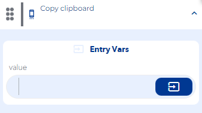
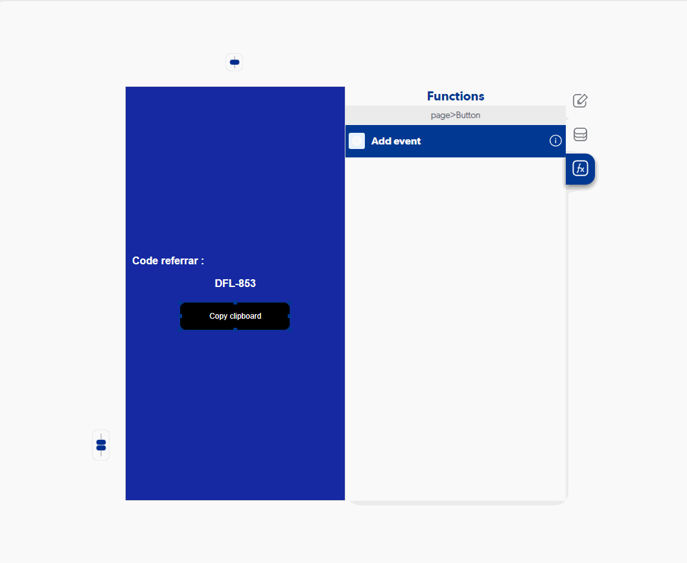

# Copy clipboard

### Entry Vars

**value :** You must enter the value you want to store in the device's clipboard.

**Step by Step :**

### Callbacks & Outvar

**On Error :** It is executed when our value was not stored in the device.

OutVars

`Null`

**On Success :** It is executed when our value is stored in the device.

OutVars

`Null`
