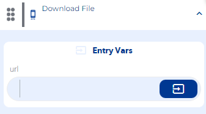

# Download file

Download file (ejemplo)

### EntryVars

**URL:**  enter the URL of the file you want to download

**Step by Step :**

### Callbacks & OutVars

**onError:** It is executed when the entered file URL is invalid.

OutVars

`Null`

**onSuccess:** It is executed when it returns the path (path) of the location of the downloaded file.

OutVars

`Null`

### Features

Puedes ver el archivo descargado desde la notificación de descarga al momento de terminar el proceso Dependiendo del tamaño del archivo, será el tiempo de espera para que se termine de descargar el documento.

### examples

