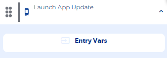
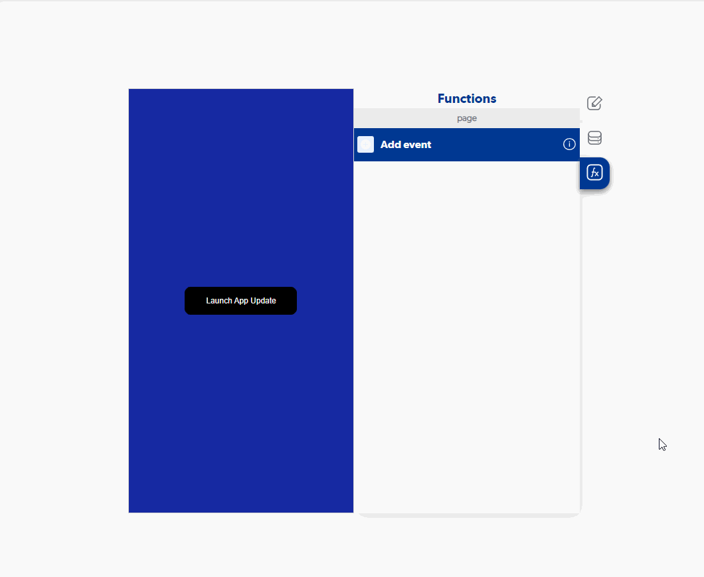

# Launch App Update

### Entry Vars

**(Does not contain Entry Vars)**

**Step by Step :**

### Callbacks & Outvar

**onError :** Runs when you don't have a connection available or app loaded in stores.

OutVars

`Null`

**onNoUpdateAvailable :** Runs when there is no update available in stores.

OutVars

`Null`

**onUpdateAvailable :** Runs when an update is available in stores.

OutVars

`Null`
