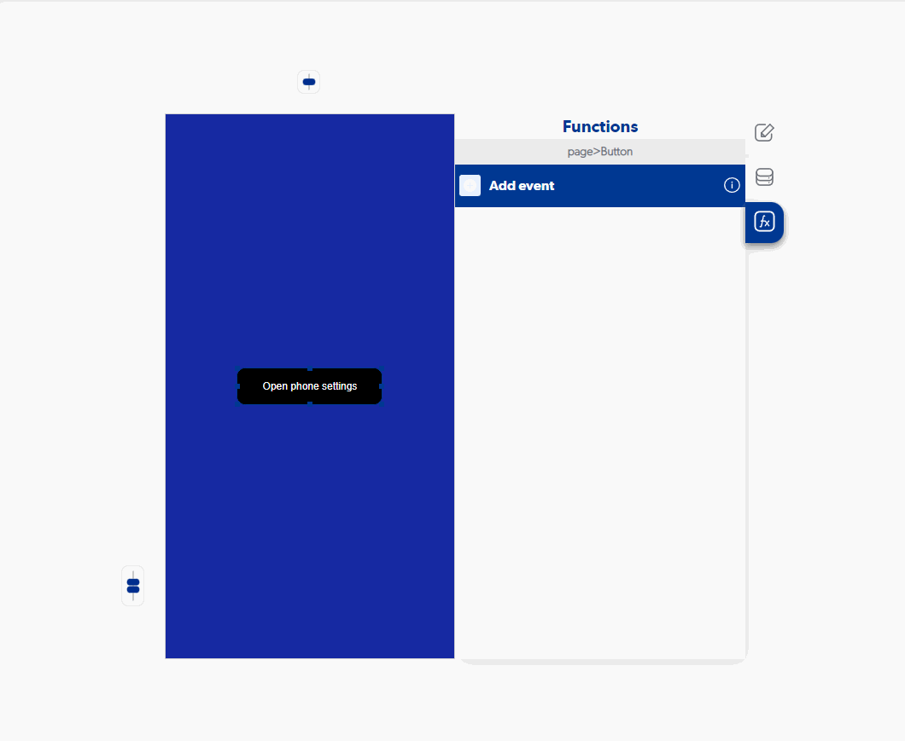
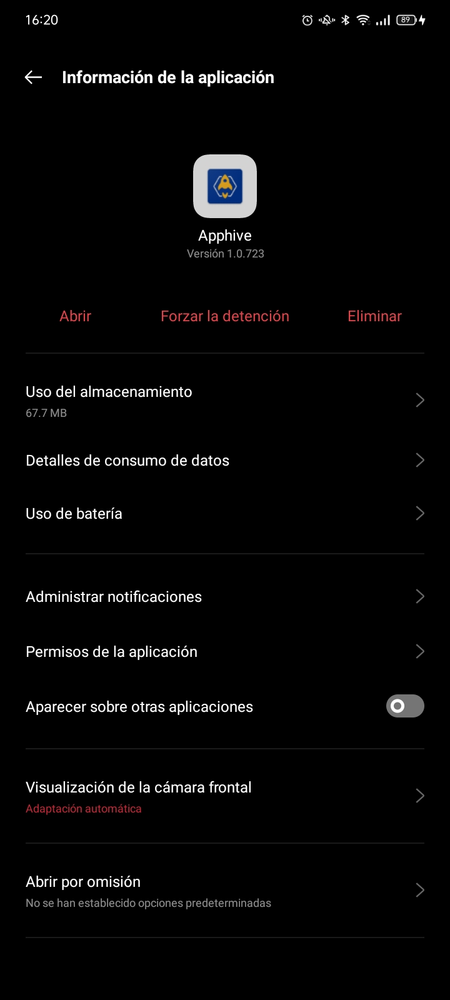

# Open phone settings

### Entry Vars

**(Does not contain Entry Vars)**

**Step by Step :**

### Callbacks & Outvar

**(Does not contain callbacks)**

OutVars

`Null`

### Features

Esta función permite abrir las configuraciones de tu aplicación.

Generalmente usada en casos en que los permisos que aparecen por primera vez son rechazados y se necesita de permisos especificos para el buen funcionamiento de la aplicación

### examples

