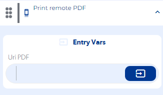
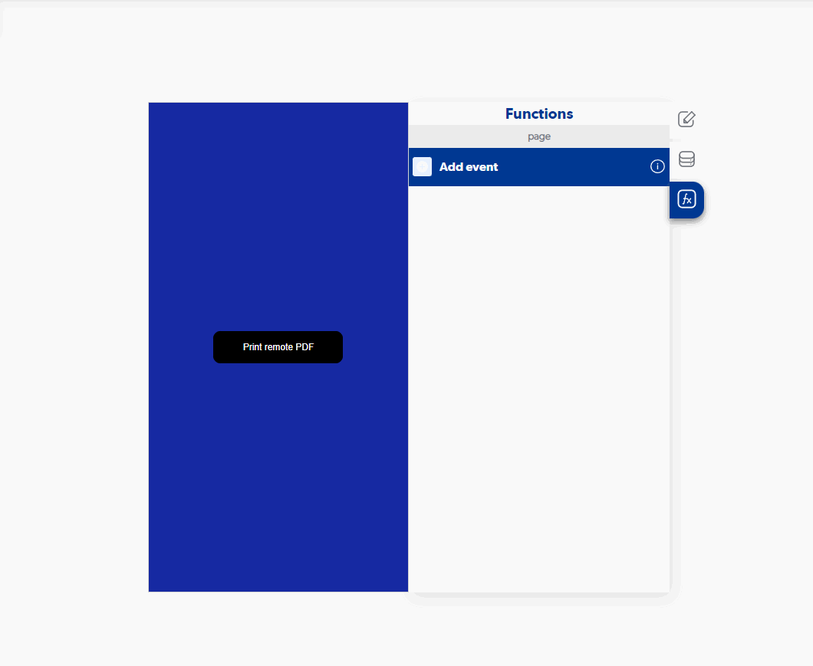

# Print remote PDF

### Entry Vars

**Uri PDF :** To use this input variable, you must specify the path of the PDF file that you wish to print. You can provide the file path online if it is hosted on the web, or the location of the file on your device. **(Required)**

**Step by Step :**

### Callbacks & Outvar

**Success :**

OutVars

`Null`

**Error :**

OutVars

`Null`
