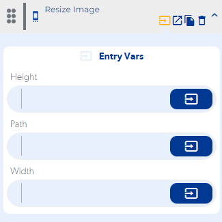
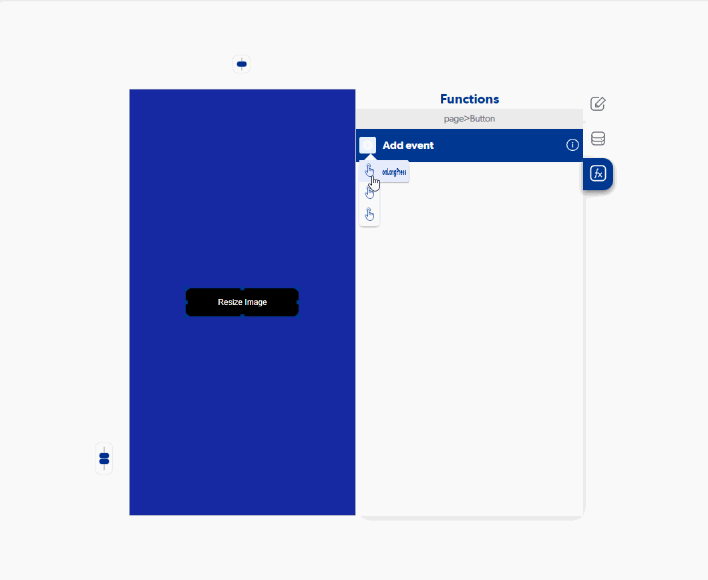

# Resize Image

### Entry Vars

**Height :** You must enter a numerical value that you want to have the width of our image.

**Path :**  You must enter the address where the image to be resized is stored.

**Width :** You must enter a numerical value that you want to have the height of our image.

**Step by Step :**

### Callbacks & Outvar

**On Error :** Fired when no valid file path is sent.

OutVars

`Null`

**On Resizer :** It is executed once the resized image is received.

OutVars

`Null`
