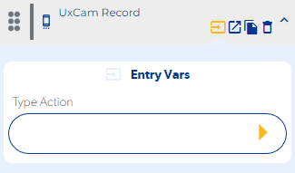
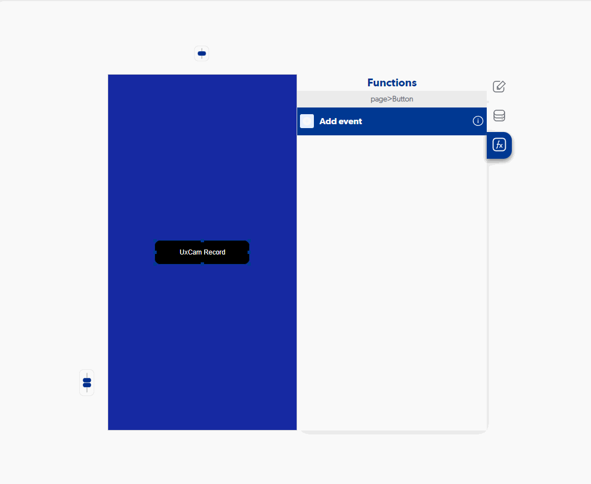

# UxCam Record

### Entry Vars

**Type Action :** The type of action that we want the function to execute must be selected. (Start, Pause.Stop)

**Step by Step :**

### Callbacks & Outvar

**On Error :** It is executed if our selected action could not be carried out or we do not have an api enabled.

OutVars

`Null`

**On Success :** It is executed once the function performs the action selected in the entry vars.

OutVars

`Null`
