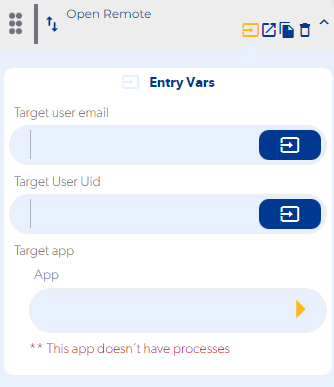

# Open Remote

### Entry Vars

**Target user email :** You must enter an email of the user to whom we want to open the application remotely. (disabled)

**Target User Uid :** The identifier of the user to whom we want to open the application remotely must be entered.

**Target app :** The application to which we want to send our push notification must be selected.

**Step by Step :**

### Callbacks & Outvar

**onError :**  It is executed when there is a connection error or the target user uid is invalid.

OutVars

`Null`

**onSuccess :** Executed when the function executes successfully.

OutVars

`Null`
