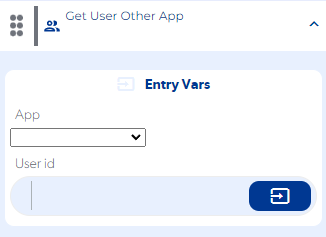
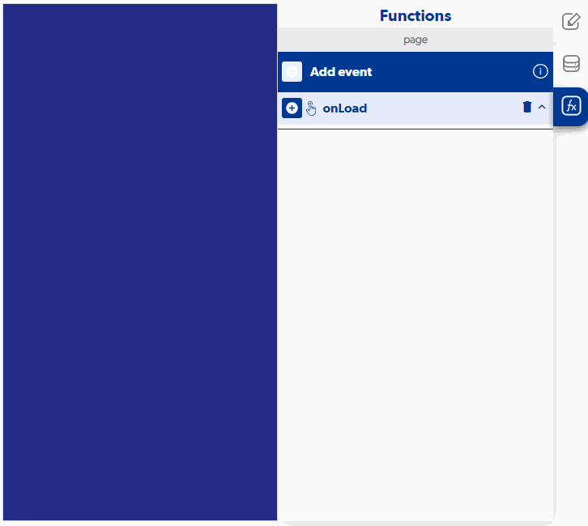

# Get User Other App

### Entry Vars

**App :** You must select the application from which you want to obtain the user.

**User id :** You must enter the current user id of the user you want to obtain.

**Step by Step :**

### Callbacks & OutVars

**Error retrieving user :** It is executed when the user does not exist or a connection was not achieved.

OutVars

`Null`

**Success retrieving user :** It is executed when it returns the information of the user that was requested.

OutVars

`Null`
