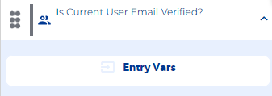
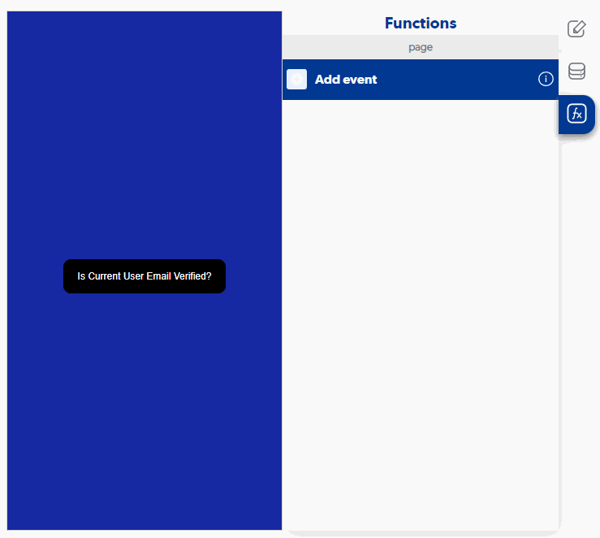

# Is Current User Email Verified?

### Entry Vars

**(Does not contain Entry Vars)**

**Step by Step :**

### Callbacks & OutVars

**User email is verified :**  It is executed when the user's email is verified.

OutVars

`Null`

**User email is not verified :** It is executed when the user's email is not verified.

OutVars

`Null`

**User is not logged in :** It is executed when no user is logged in to verify their email.

OutVars

`Null`
