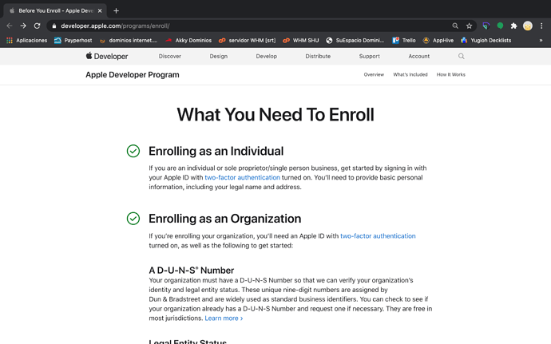
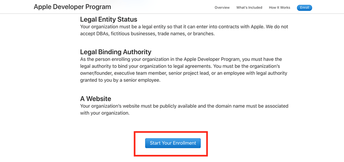
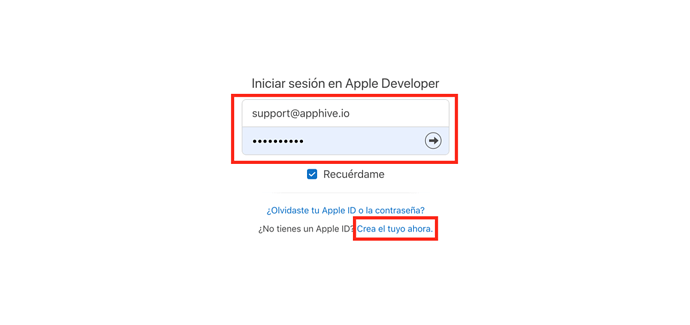

# Crear cuenta de desarrollador

1.- Primero entra a  [https://developer.apple.com/programs/enroll/](https://developer.apple.com/programs/enroll/)

<figure><figcaption>
Crear cuenta de desarrollador
</figcaption></figure>

2.- Da click en Start your Enrollment.

<figure><figcaption>
Iniciar Registro
</figcaption></figure>

3.- Inicia con ti Apple ID, si no tienes uno puedes presionar en Crear uno, si ya tienes peudes iniciar con ese

<figure><figcaption>
Inicia sesión con tu id de Apple
</figcaption></figure>

4.- Una vez iniciado elige el tipo de entindad, si tienes una empresa constituida selecciona Company, si en cambio la abrirás únicamente como persona selecciona Individual

<figure><figcaption>
Selecciona el tipo de entidad
</figcaption></figure>

5.- Ingresa tus datos como Nombre, Dirección, teléfono

<figure><figcaption>
Ingresa tus datos
</figcaption></figure>

6.- Finalmente hay que realizar el pago con cualquier tarjeta bancaria para concluir el proceso

<figure><figcaption>
Agrega los datos de la tarjeta
</figcaption></figure>
