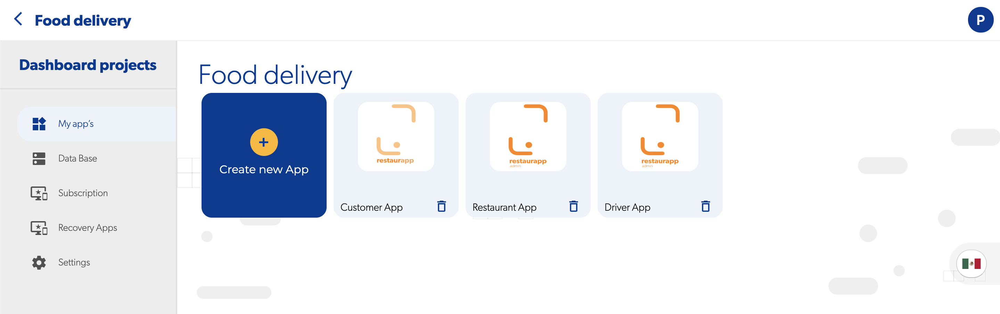

# 🔍 Apphive

### ¿Qué es un proyecto?

Un proyecto es un grupo de aplicaciones que comparten la misma base de datos y contexto, por ejemplo, si deseas crear una aplicación de entrega de alimentos, un proyecto puede contener tres aplicaciones, la aplicación de restaurante, la aplicación de usuario y la aplicación del repartidor

### ¿Cuales son las configuraciones de un proyecto?

La configuración de un proyecto afecta a todas las aplicaciones que están dentro de él, las configuraciones disponibles son:

* [B](../reference/base-de-datos/README.md)ase de datos
* [Suscripción](../precios/precio.md)
* Geofire categorias
