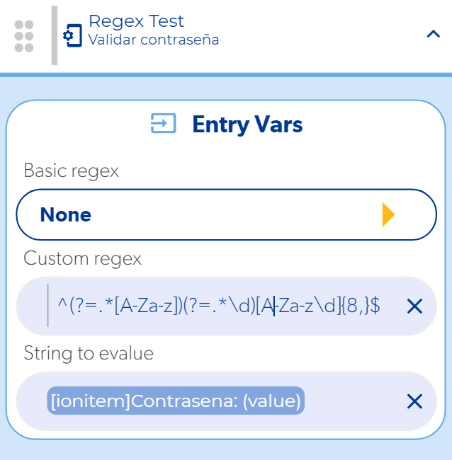

# 5 tipos de validación de contraseñas

Para validar el campo de contraseña de un formulario usa la función **Regex Test** (dentro de **Logic**) con una expresión regular personalizada. Estas son cinco reglas comunes, de la más sencilla a la más estricta.



## Las 5 expresiones

**1. Mínimo 8 caracteres, al menos una letra y un número**

```
^(?=.*[A-Za-z])(?=.*\d)[A-Za-z\d]{8,}$
```

**2. Mínimo 8 caracteres, al menos una letra, un número y un carácter especial**

```
^(?=.*[A-Za-z])(?=.*\d)(?=.*[@$!%*#?&])[A-Za-z\d@$!%*#?&]{8,}$
```

**3. Mínimo 8 caracteres, al menos una mayúscula, una minúscula y un número**

```
^(?=.*[a-z])(?=.*[A-Z])(?=.*\d)[a-zA-Z\d]{8,}$
```

**4. Mínimo 8 caracteres, al menos una mayúscula, una minúscula, un número y un carácter especial**

```
^(?=.*[a-z])(?=.*[A-Z])(?=.*\d)(?=.*[@$!%*?&])[A-Za-z\d@$!%*?&]{8,}$
```

**5. Entre 8 y 10 caracteres, al menos una mayúscula, una minúscula, un número y un carácter especial**

```
^(?=.*[a-z])(?=.*[A-Z])(?=.*\d)(?=.*[@$!%*?&])[A-Za-z\d@$!%*?&]{8,10}$
```

## Cómo usarlas en Regex Test

1. Agrega la función **Regex Test** en el evento donde validas el formulario (por ejemplo, el botón de registro).
2. Deja **Basic regex** en **None** y pega la expresión en **Custom regex**.
3. En **String to evalue** selecciona el valor del campo de contraseña.
4. En el callback **Match** continúa con el registro; en **Does not match** muestra un mensaje al usuario explicando la regla.

Consulta todos los parámetros en la referencia de [Regex Test](../reference/funciones/logic-e/regex-test/README.md).

## Cambiar la longitud

El número entre llaves al final controla la longitud:

- `{8,}` → 8 caracteres o más.
- `{8,10}` → entre 8 y 10 caracteres.
- `{8,15}` → entre 8 y 15 caracteres.

!!! tip
    Antes de usar una expresión en tu app, pruébala con varias contraseñas en [regexr.com](https://regexr.com/). Si una expresión no te funciona, revisa que la hayas copiado completa, sin espacios al inicio o al final.

Más ejemplos de expresiones (nombre, correo, URL) en [Función Regex Test](funcion-regex-test.md).
