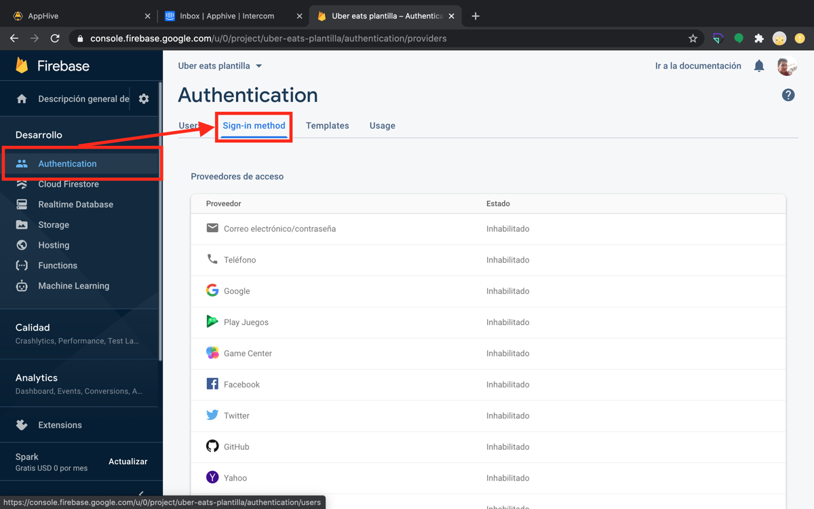
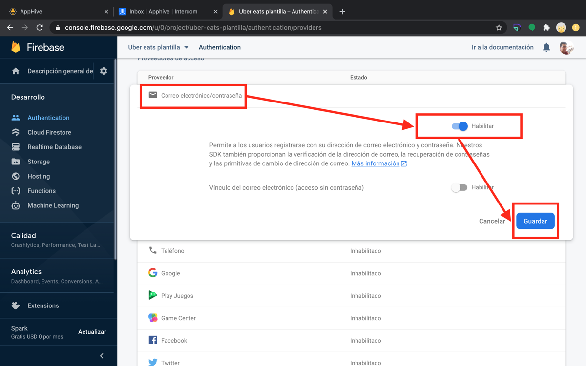

# Activar el sign-in method de correo electrónico y contraseña

Para que los usuarios de tu app puedan registrarse e iniciar sesión con correo y contraseña, habilita ese proveedor en **Firebase → Authentication → Sign-in method**.

## Pasos

1. Entra a [firebase.google.com](https://firebase.google.com/) y da clic en **Ir a la consola**.

    

2. Da clic en tu proyecto de Firebase.

    

3. Da clic en **Authentication** y selecciona la pestaña **Sign-in method**.

    

4. Selecciona **Correo electrónico/contraseña**, actívalo con **Habilitar** y da clic en **Guardar**.

    

Después de esto ya puedes usar las funciones [Sign Up](../reference/funciones/users-e/sign-up/README.md) y [Login](../reference/funciones/users-e/login/README.md) en tu app.
