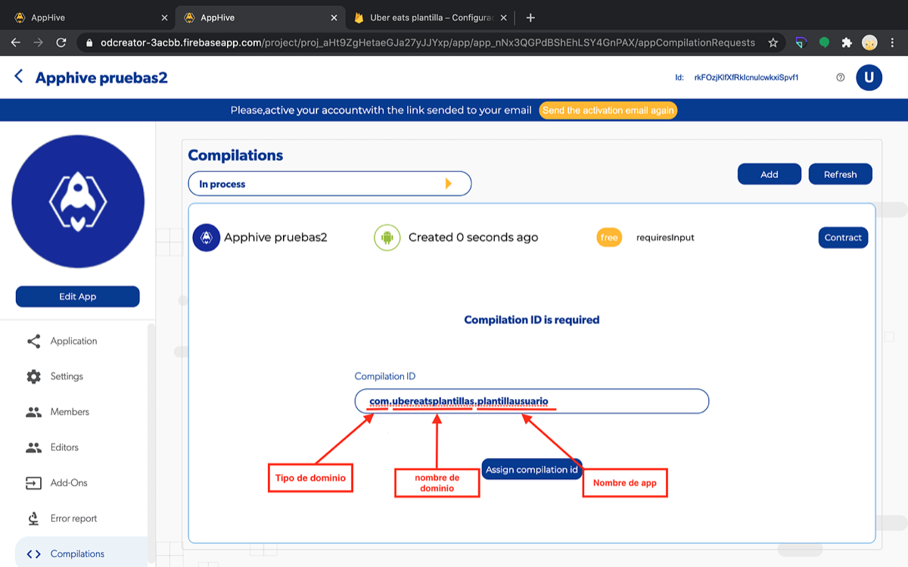

# Agregar un ID de compilación

El **ID de compilación** (compilation ID) identifica tu app en las tiendas. Se escribe con tres partes separadas por un punto, sin espacios: `tipodedominio.nombre.nombredelaapp`. Por ejemplo: `com.miempresa.appusuario`.

## Estructura

| Parte | Qué es | Ejemplos |
| --- | --- | --- |
| Tipo de dominio | Terminación de dominio | `com`, `net`, `org`, `io`, `mx` |
| Nombre de dominio | Nombre de tu empresa o proyecto | `miempresa`, `apphive` |
| Nombre de la app | Nombre con el que identificas esa app | `appusuario`, `appconductor` |

No necesitas tener un dominio web registrado: solo se usa el formato.

!!! warning "Reglas"
    - **No** uses mayúsculas, acentos, espacios ni signos de puntuación; el único signo permitido es el punto que separa las partes.
    - Evita también los números.

## Pasos

1. Escribe tu ID de compilación con la estructura anterior.
2. Da clic en **Assign compilation id**.
3. Copia el ID y guárdalo en un lugar seguro: lo necesitarás en procesos posteriores (por ejemplo, al configurar tu app en App Store).

!!! note
    Si tu proyecto tiene varias apps (por ejemplo, usuario y conductor), cada una necesita su propio ID de compilación.
