# Añadir la app de Android a Facebook

Para que el inicio de sesión con Facebook funcione en tu app de Android, registra la plataforma Android en tu app de Facebook Developers con tres datos: el **nombre del paquete** de Android, la clase **MainActivity** y el **Release key hash**. El nombre del paquete y el key hash los copias desde Apphive.

## Pasos

1. Abre el panel de tu app en Facebook Developers (*Facebook app dashboard*).

    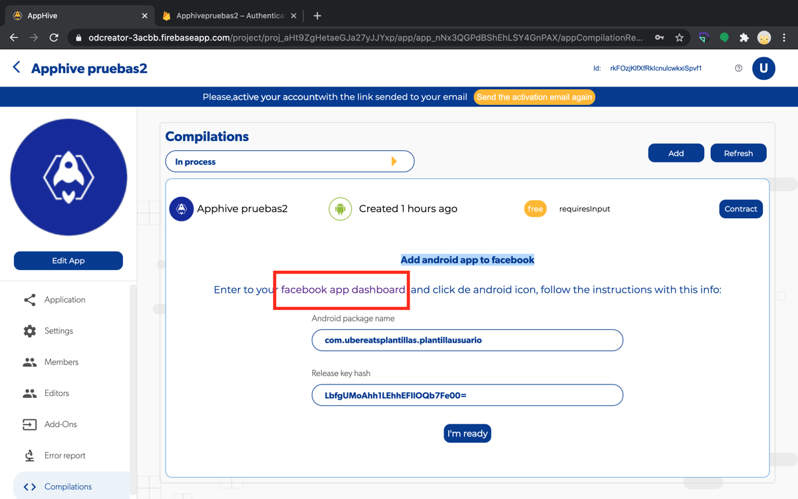

2. Da clic en el ícono de **Android**.

    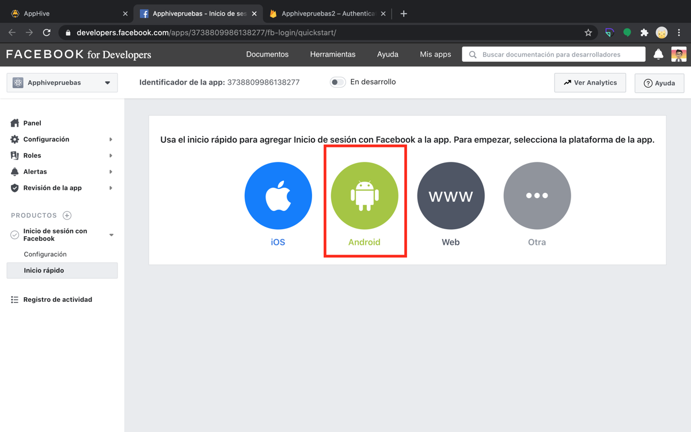

3. Da clic en **Siguiente**.

    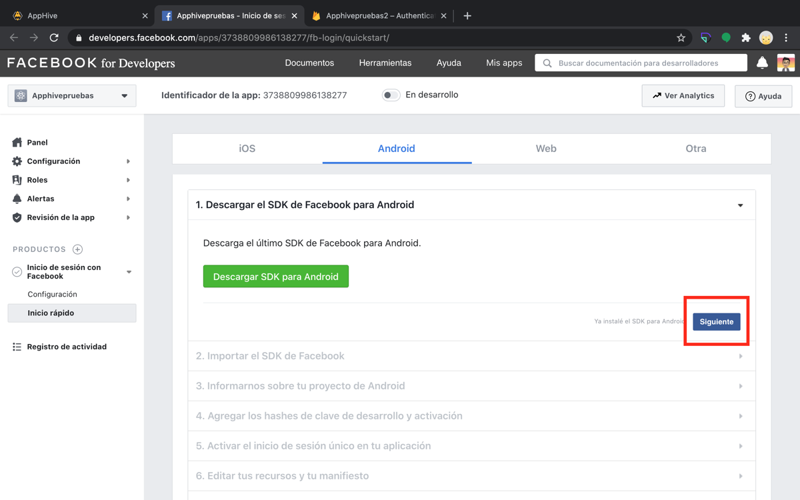

4. Da clic en **Siguiente** otra vez.

    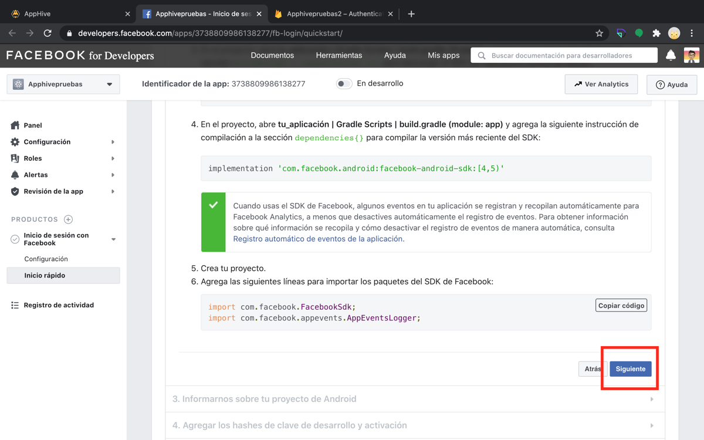

5. Regresa a Apphive y da clic sobre el **Android package name** para copiarlo.

    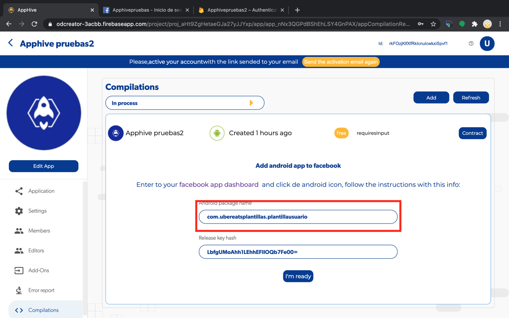

6. En Facebook, pega el Android package name en **Nombre del paquete**. En el nombre de la clase escribe `MainActivity` (exactamente así, con las mismas mayúsculas y sin espacios) y da clic en **Save**.

    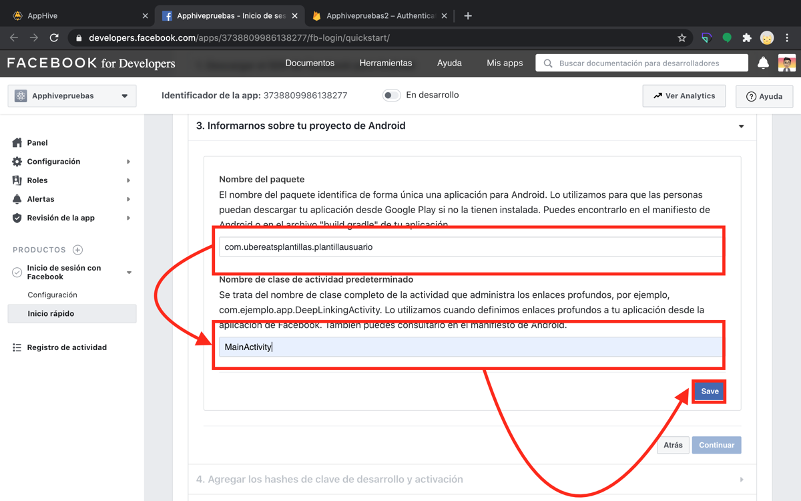

7. Da clic en **Usar el nombre de este paquete**.

    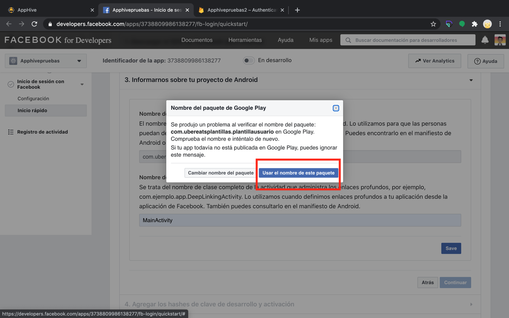

8. Da clic en **Continuar**.

    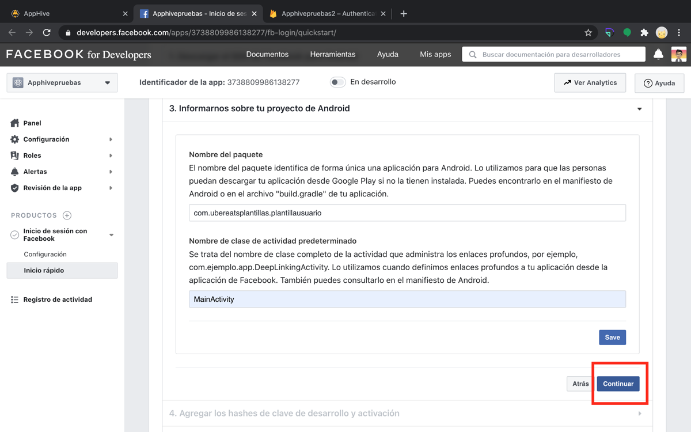

9. Regresa a Apphive y da clic sobre el **Release key hash** para copiarlo.

    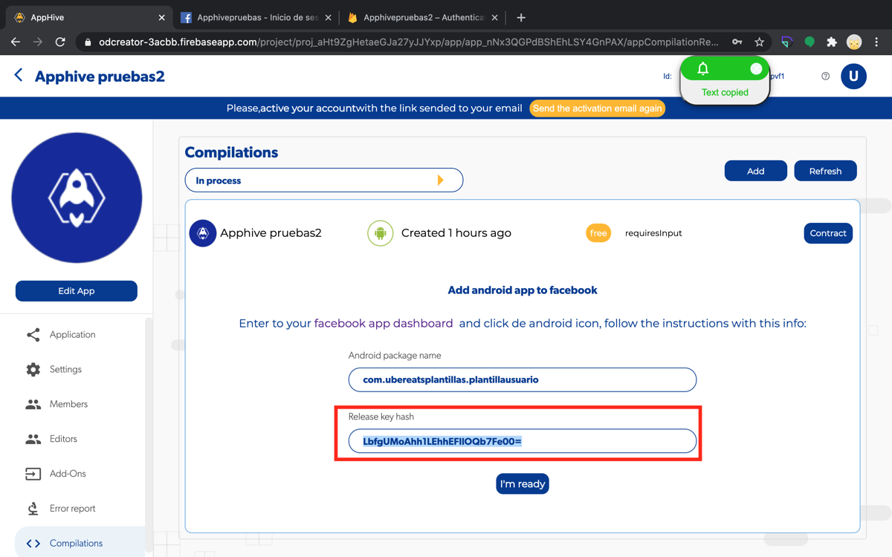

10. En Facebook, pega el Release key hash en **Hashes de clave**, selecciona el hash (se marca en azul) y da clic en **Save**.

    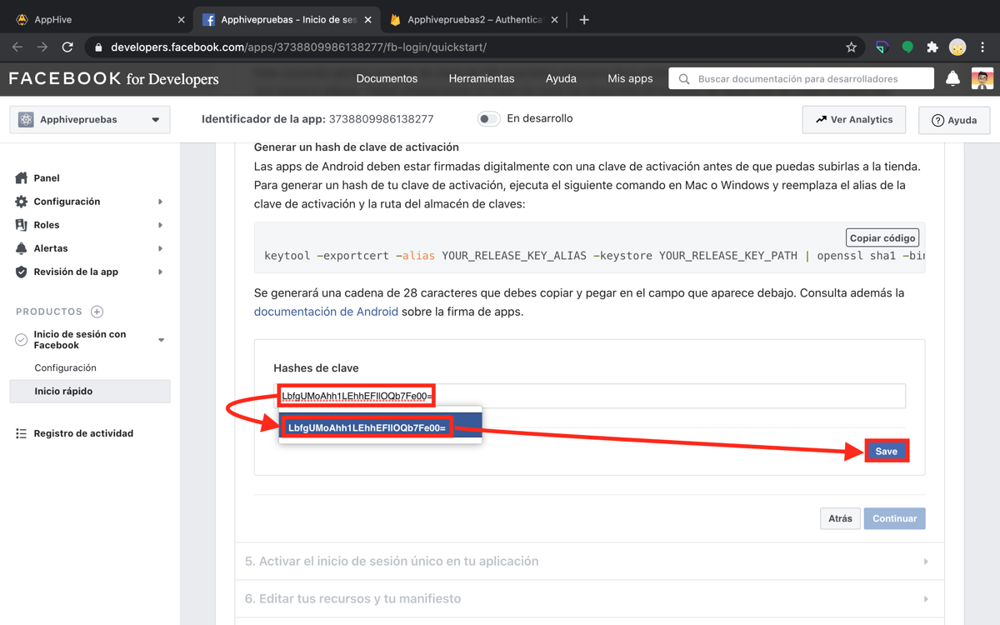

11. Da clic en **Continuar**.

    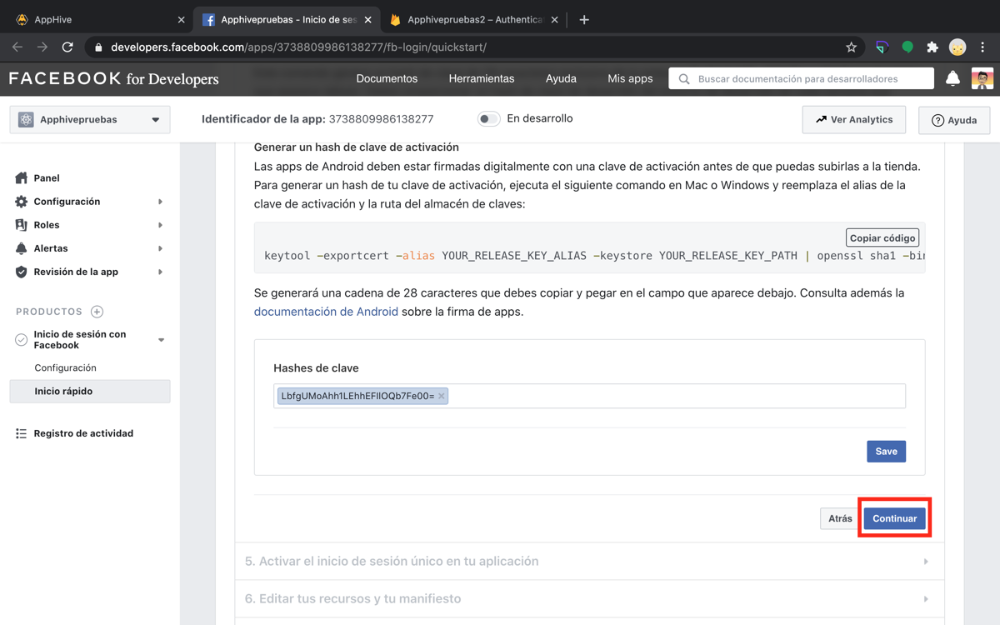

12. Activa el switch de **Inicio de sesión único**, da clic en **Save** y luego en **Siguiente**.

    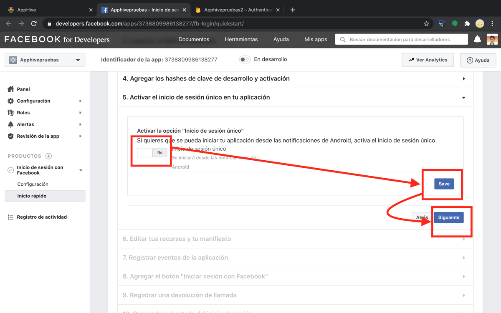

13. Regresa a Apphive y da clic en **I'm ready**.

    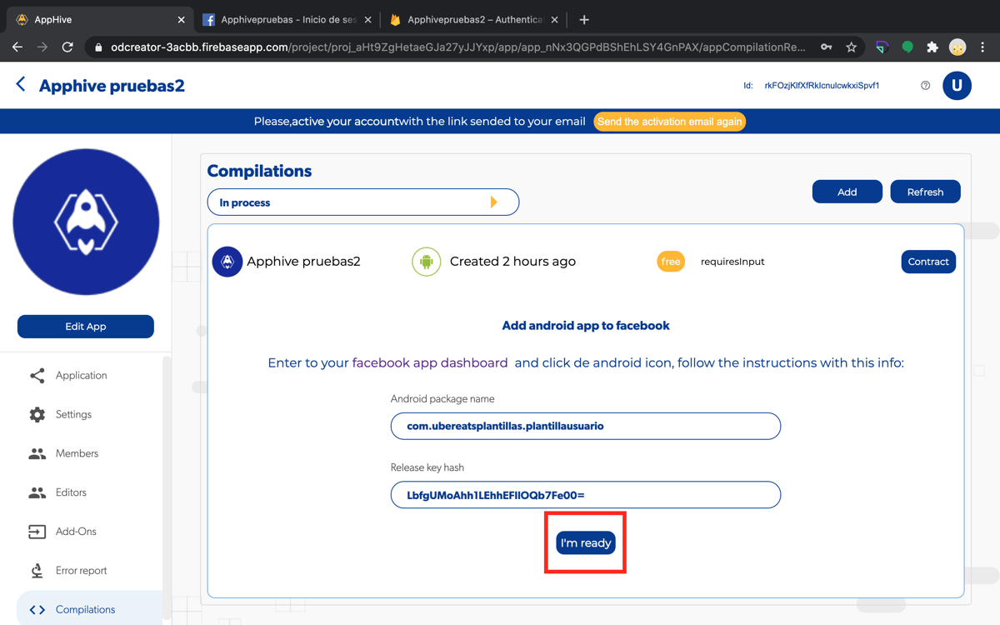

!!! warning
    Escribe `MainActivity` tal cual. Un cambio de mayúsculas o un espacio extra hace que el inicio de sesión con Facebook falle.
