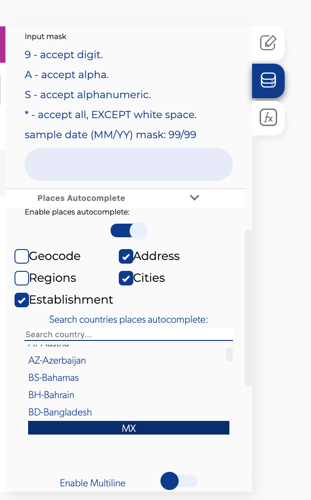
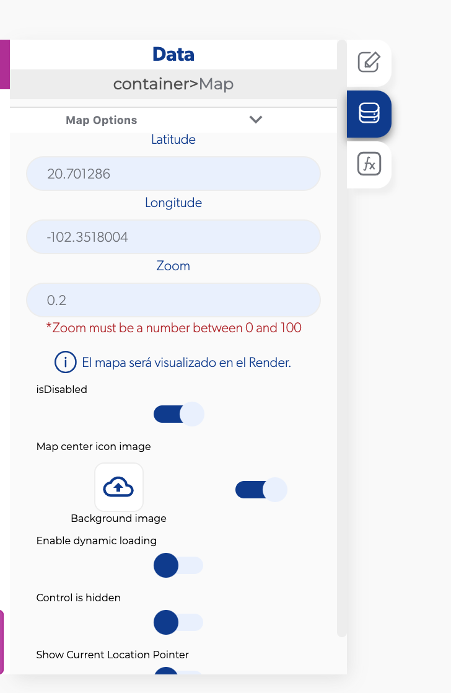
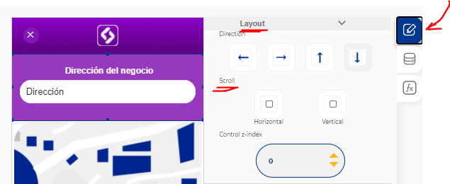

# API de Google Maps: no carga el autocompletado de direcciones

Si el autocompletado de direcciones (o el mapa) no carga en tu app, casi siempre se debe a una de estas tres cosas: tu proyecto de Google Cloud no tiene un método de pago, no agregaste tu Google API key en Apphive o no habilitaste las APIs de Google necesarias.

## 1. Agrega un método de pago en Google Cloud

!!! warning "La causa más común"
    Si no tienes una tarjeta y una cuenta de facturación asociadas a tu proyecto de Google Cloud, tu API **no funcionará**.

1. Entra a [Google Cloud Console](https://console.cloud.google.com/) con la cuenta dueña del proyecto.
2. Enlaza una cuenta de facturación al proyecto y agrega una tarjeta de crédito o débito.
3. Si Google te pide verificar la cuenta, termina la verificación: hasta entonces las APIs no responden.

Consulta los precios vigentes de Google Maps Platform en [cloud.google.com/maps-platform/pricing](https://cloud.google.com/maps-platform/pricing).

## 2. Agrega tu Google API key en Apphive

Crea una API key en tu proyecto de Google Cloud y pégala en la configuración de tu app en Apphive, en la sección de API keys. Paso a paso completo: [Cómo obtener tu API key de Google](paso-a-paso-de-como-obtener-tu-api-key-de-google.md).

## 3. Habilita las APIs de Google

En tu proyecto de Google Cloud habilita estas APIs:

- Directions API
- Distance Matrix API
- Maps JavaScript API
- Maps SDK for Android
- Maps SDK for iOS
- Places API (es la que usa el autocompletado)
- Geocoding API

Video con el paso a paso: [https://www.youtube.com/watch?v=JFQ8sF1G-7Q&t=265s](https://www.youtube.com/watch?v=JFQ8sF1G-7Q&t=265s)

## Problemas comunes

### El autocompletado solo muestra direcciones de México

El campo de texto con autocompletado tiene **México** como país por defecto. Cambia el país en la configuración del campo. Del mismo modo, si el mapa no se centra donde esperas, modifica la latitud y longitud por defecto del mapa.

 

### Aparecen sugerencias, pero no se puede seleccionar ninguna

Lo más probable es que el contenedor donde está el campo de autocompletado tenga el **scroll** activo: el scroll capta el toque en lugar de la sugerencia. Desactiva el scroll en ese contenedor.

Si el problema persiste, revisa que tu API key sea correcta y que la Places API esté activa.

### Al elegir una dirección no pasa nada

- Agrega el evento que quieres ejecutar (por ejemplo, ir al mapa) en el **onChange** del campo de autocompletado.
- Si metiste el campo de dirección dentro de otro contenedor y dejó de funcionar, prueba a sacarlo de ese contenedor.

### En la pantalla aparece todo el resultado en lugar de la dirección

Estás enviando el objeto completo del resultado (latitud, longitud, etc.). Envía solo la propiedad de la dirección.

### Calcular la distancia entre dos puntos

Usa la función integrada [Get Distance](../reference/funciones/geolocation/get-distance.md) del grupo Geolocation. Si no ves el resultado, muestra un alert con la salida de la función para revisar qué devuelve, y con otro alert revisa qué latitud y longitud le estás enviando al mapa.

!!! note
    Para obtener sugerencias de lugares desde una función, consulta [Función Places Autocomplete Predictions](funcion-places-autocomplete-predictions.md).
