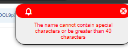

# Cambiar el nombre en una app compilada

Una app compilada conserva el nombre que tenía al compilarse. Para cambiar el nombre que aparece en el teléfono, cámbialo en el editor de Apphive y **vuelve a compilar**. El nombre que aparece en la ficha de Google Play se edita aparte, en Play Console.

## Nombre en el teléfono

1. Cambia el nombre de la app en el editor de Apphive.
2. Compila de nuevo. La nueva compilación usará el último nombre que guardaste.

### El editor no acepta el nombre

Si al guardar aparece una alerta aunque el nombre no tenga caracteres especiales ni pase de 40 caracteres, revisa:

- Que no lleve acentos (tildes).
- Que no tenga más de un espacio. Por ejemplo, `Mi App` es válido, pero `Mi App Favorita` no.

## Nombre en Google Play

El nombre de la ficha de la tienda se modifica en [Google Play Console](https://play.google.com/console), en la ficha de tu app.
