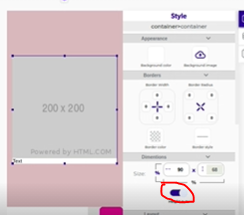

# Chat con imágenes

Puedes convertir un chat de texto en un chat con imágenes con pequeños ajustes a tu chat actual. La clave para que cada mensaje ocupe sólo el espacio que necesita es poner **Height Auto** en el contenedor que contiene la imagen.

## Videos paso a paso

1. Cómo agregar imágenes al chat: [ver video](https://www.loom.com/share/26da5eb0f27f453abe603768304fc906)
2. Pruebas del chat funcionando y ajuste de la altura: [ver video](https://www.loom.com/share/8eb8247c0d2247639fdd4c40df7ecb3c) (el ajuste de altura se explica cerca del minuto 11:20).

## Ajustar la altura cuando un mensaje no tiene imagen

Si un mensaje no trae imagen, el espacio de la imagen no debe quedar vacío. Para eso, selecciona el contenedor que contiene la imagen y en su alto (Height) elige **Auto**:

Así el contenedor crece cuando hay imagen y se reduce cuando no la hay.
