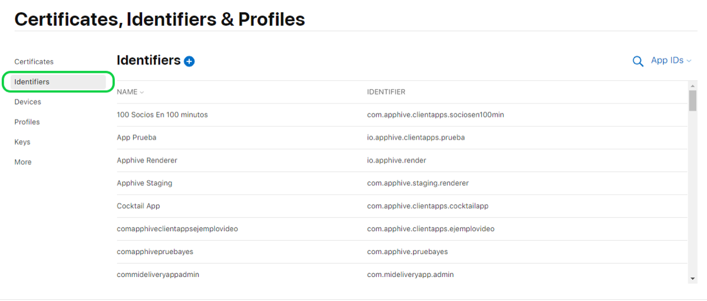
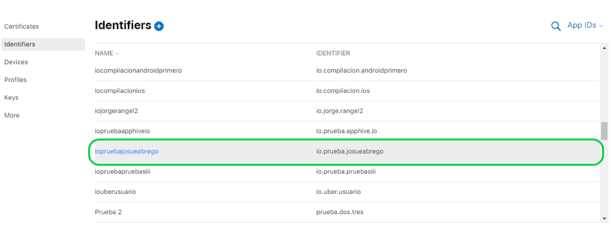
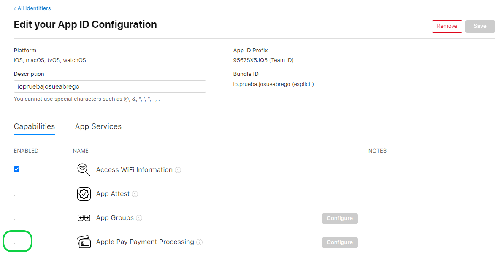
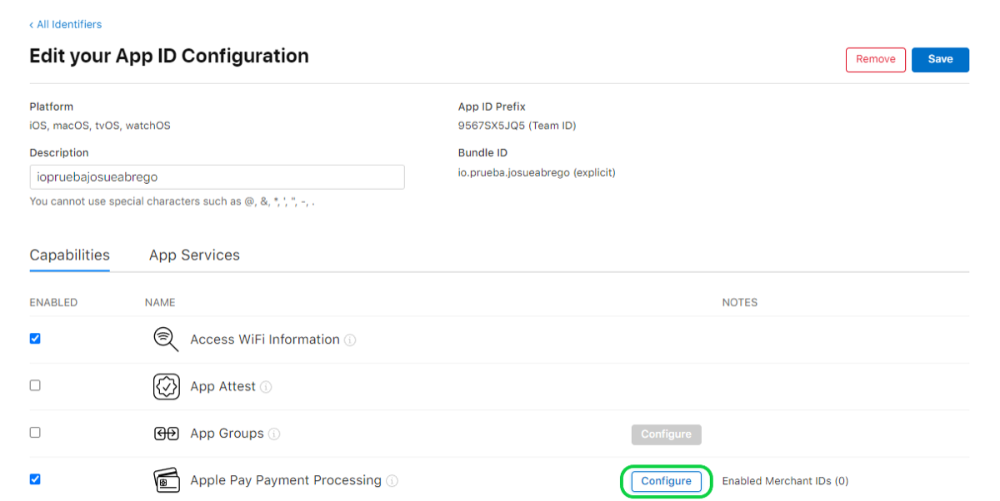
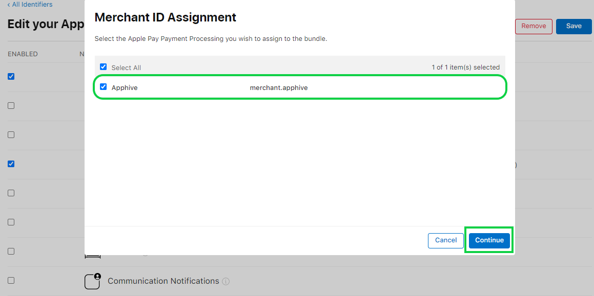
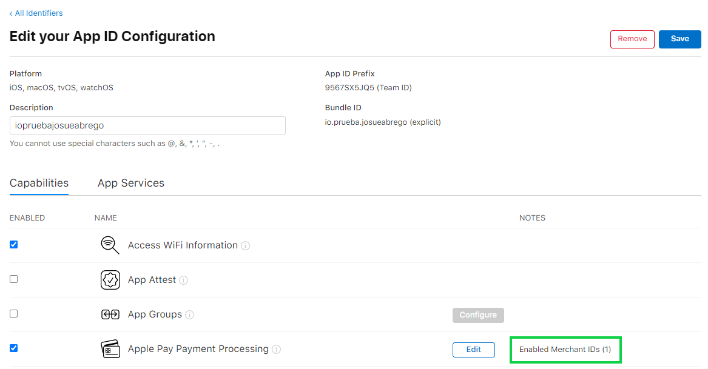

# Código de error: 18

El código de error 18 aparece cuando tu app usa una función de **Apple Pay** (pagar con Apple Wallet) y en tu cuenta de Apple no está activada la capacidad **Apple Pay Payment Processing** para esa app. Actívala en su identificador, asígnale un Merchant ID y vuelve a compilar.

## Cómo resolverlo

1. Entra a [Certificates, Identifiers & Profiles](https://developer.apple.com/account/resources/identifiers/list/bundleId) y ve a la sección **Identifiers**.
   
2. Busca en la lista el identificador (**Compilation ID**) de la app con el error y da clic para abrir su configuración.
   
3. Baja a la sección **Capabilities**, busca **Apple Pay Payment Processing** y marca su casilla. Se habilita el botón **Configure**: da clic en él.
   
   
4. Selecciona el **Merchant ID** que creaste antes (o crea uno nuevo) y da clic en **Continuar**.
   
5. Con esto el Merchant ID queda asignado al pago con Apple Pay.
   
6. Vuelve a compilar tu app desde Apphive.

Si la compilación termina con éxito, el problema quedó resuelto.

## Si el error continúa

Escribe a soporte desde el chat del editor (abajo a la derecha) con esta información:

1. Tu correo electrónico de contacto.
2. La URL de la app con error.
3. El código de error que recibiste por correo (incluye una captura del correo).
4. Lo que ya intentaste antes de escribir.
