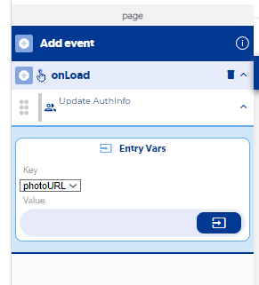

# Cómo cambiar la foto de perfil que previamente se subió a la nube

Subir una foto nueva no reemplaza sola la anterior: tienes que guardar la URL de la nueva foto en el mismo lugar donde guardaste la primera. Cómo hacerlo depende de dónde guardas los datos del usuario.

## Si la foto es una propiedad del usuario

Si la foto está junto a los datos por defecto del usuario (donde aparecen el nombre, el teléfono, etc.), actualízala con una función de usuarios que modifique esa propiedad, como [Update AuthInfo](../reference/funciones/users-e/update-authinfo/README.md), que actualiza la información por defecto del usuario con sesión iniciada.

## Si la foto está en una colección de la base de datos

Si guardas los datos del usuario en una colección, basta con guardar siempre en el **mismo id del usuario**. Así, al guardar la nueva foto, se sobrescribe la que ya tenía. Consulta [Save in DB](../reference/funciones/base-de-datos-e/save-in-db/README.md).
