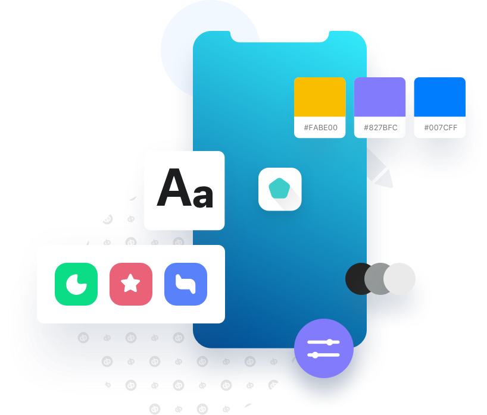
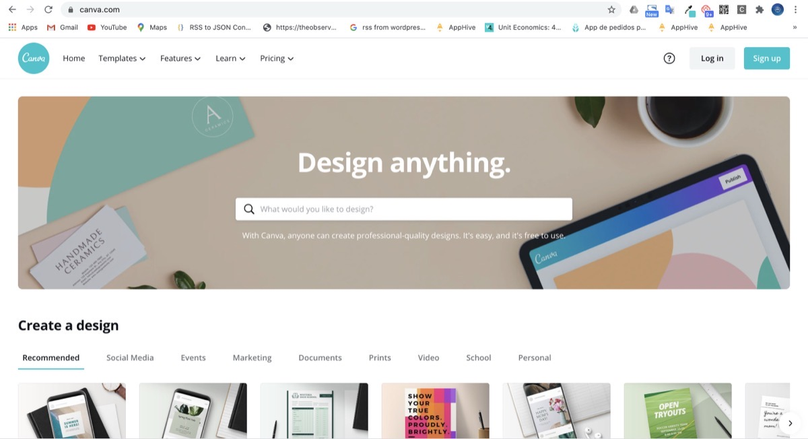
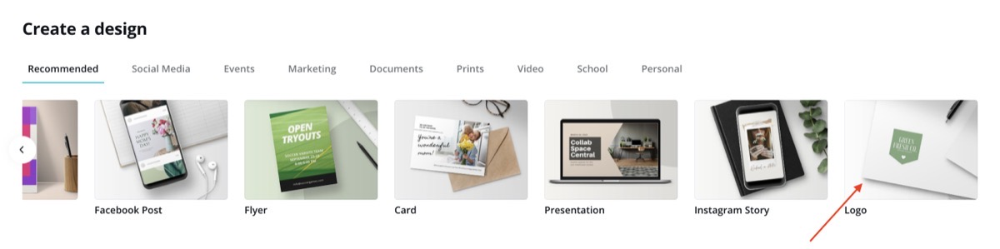
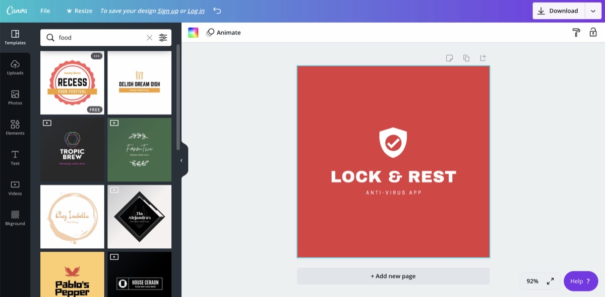
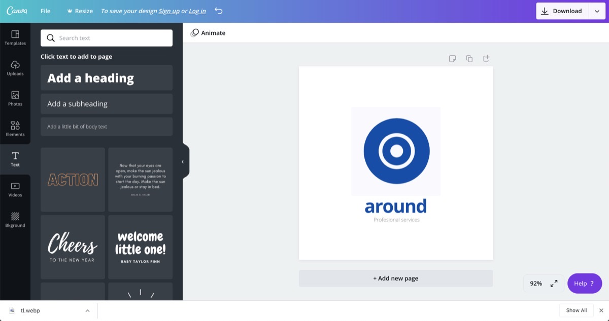
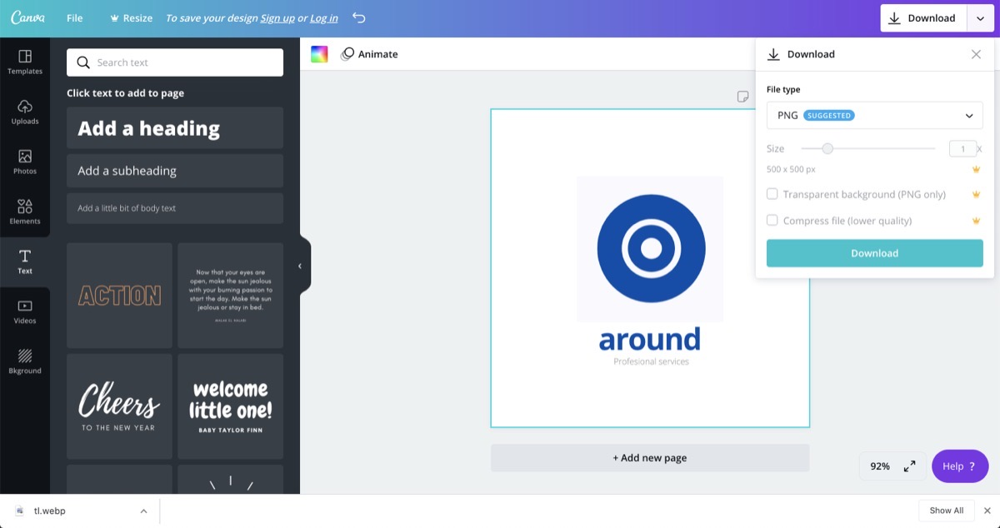
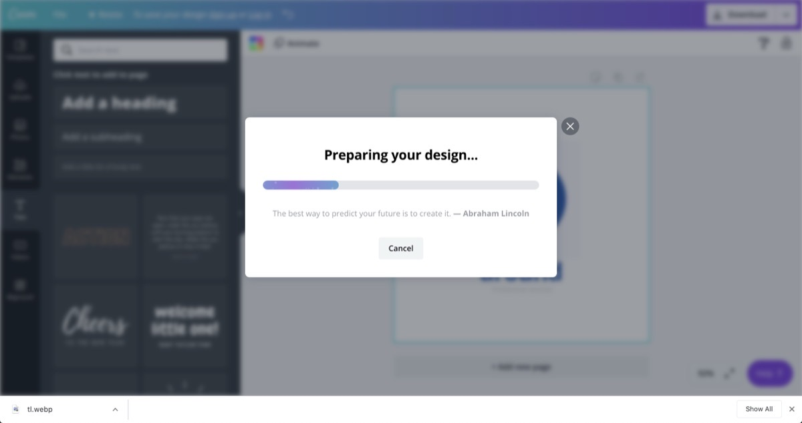
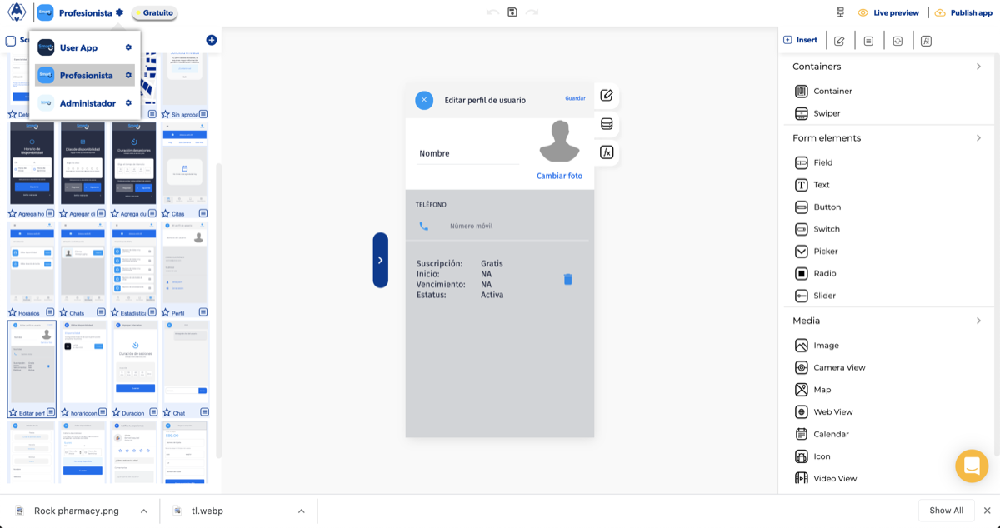
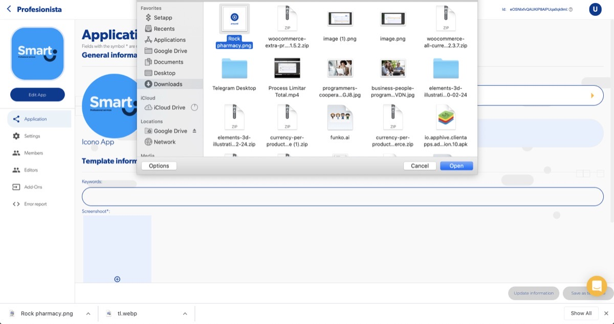
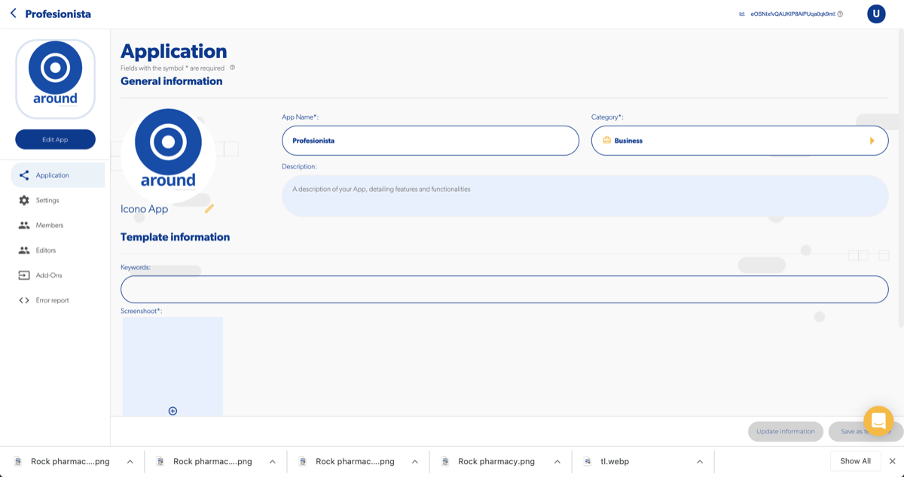

# Cómo hacer el branding o logo de mi app (si no cuento con un diseñador)

Si no cuentas con un diseñador, puedes crear un logo sencillo para tu app en [Canva](https://www.canva.com/), descargarlo y cargarlo en el editor de Apphive.

## ¿Por qué importa el branding?

El branding de una app busca que tus clientes reconozcan tu marca rápidamente en las tiendas. Además del buen funcionamiento de la app, cuidan tu imagen visual, la comunicación, el valor para el usuario, una experiencia de uso agradable y la uniformidad con tu marca.

## Crear el logo en Canva

1. Entra a [canva.com](https://www.canva.com/).

    

2. Elige la opción **Logotipo**.

    

3. Elige una plantilla o empieza desde cero. Evita formas muy elaboradas y no satures la composición.

    

    

4. Al terminar, ve a la sección **Descargar** (Download) y descarga tu logo.

    

    

## Cambiar el logo en el editor de Apphive

1. En el editor, da clic en el cuadro del lado izquierdo o en el ícono de cambiar logotipo.

    

    

2. Elige tu archivo y sustituye el logo actual.

    

!!! tip
    Puedes usar Canva para hacer un boceto y después pedirle a un diseñador gráfico que desarrolle tu imagen de forma profesional.
