# ¿Cómo hacer un slider automático de promociones?

Usa un **Swiper** con una imagen en cada vista y activa la opción **Auto Play Seconds** del Swiper: las vistas cambian solas cada cierto número de segundos, el tiempo que tú elijas. Si quieres que las promociones vengan de la base de datos, cambia la propiedad `src` de cada imagen con **Modify control**.

## 1. Diseño de la interfaz

1. Coloca un contenedor al 100 % de ancho. En este ejemplo el slider ocupa el 25 % de la pantalla.
   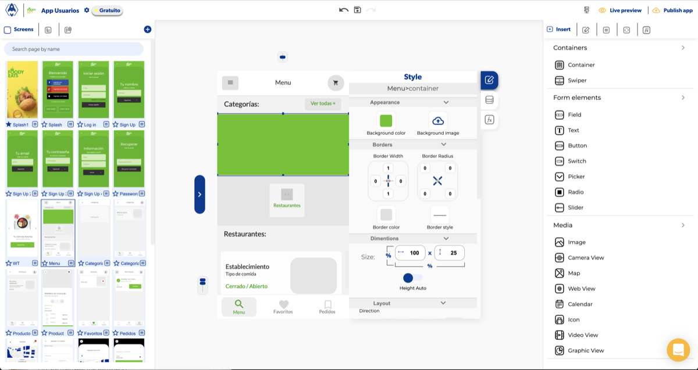
2. Agrega el elemento **Swiper** dentro del contenedor.
   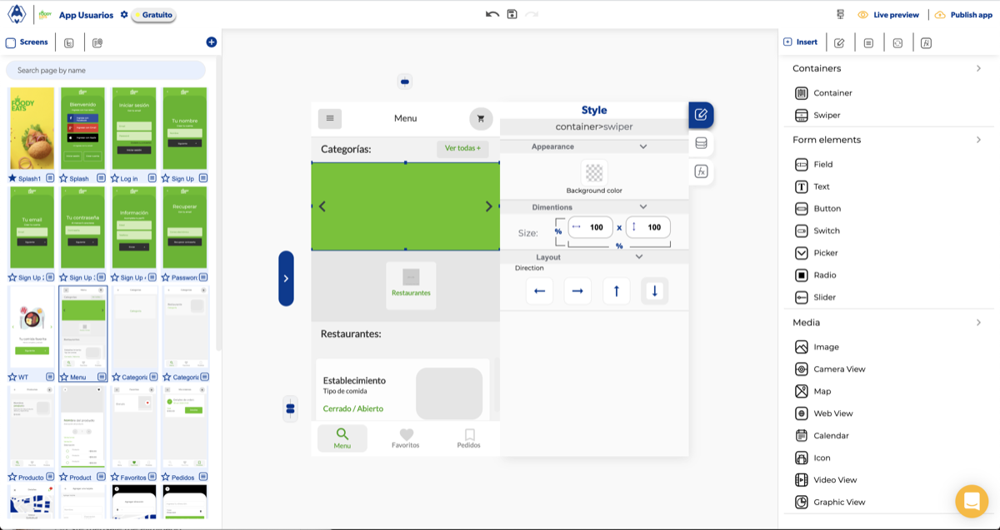
3. Dentro de cada vista del Swiper agrega una **imagen** con el ancho y alto que necesites (en el ejemplo, 100 % x 100 %). Activa la opción **Contain** para que la imagen se adapte al contenedor.
   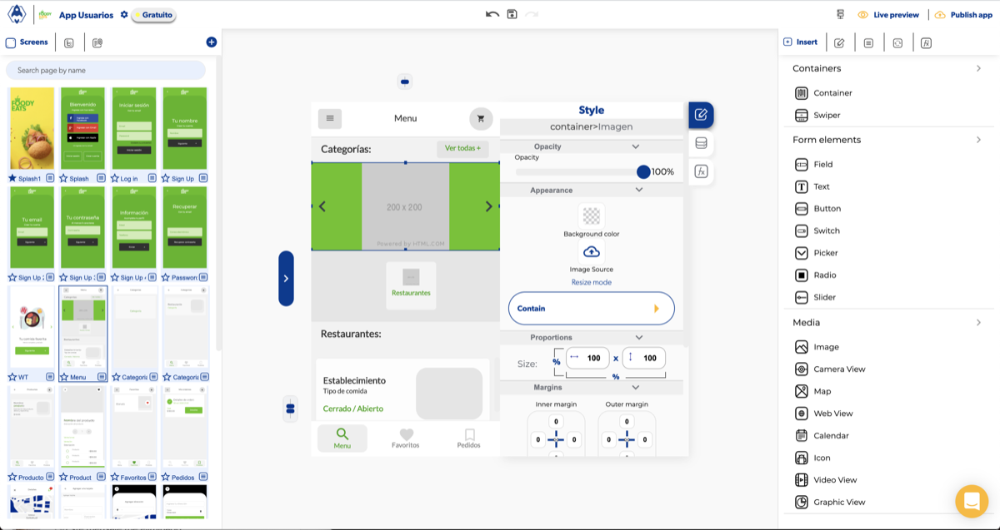

Ponle a cada imagen un nombre fácil de identificar: `banner1`, `banner2`, `banner3`, etc.

## 2. Hacer que avance solo

Selecciona el Swiper y configura **Auto Play Seconds** con el número de segundos que debe durar cada promoción.

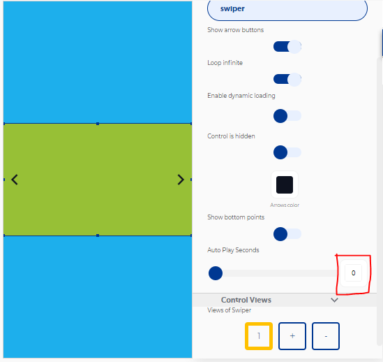

## 3. (Opcional) Cargar las promociones desde la base de datos

1. En la base de datos crea la colección de promociones (en el ejemplo, **Ofertas**) con los campos **Negocio id** y **Oferta principal** (la URL de la imagen).
   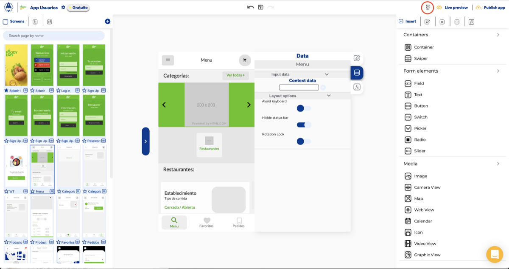
   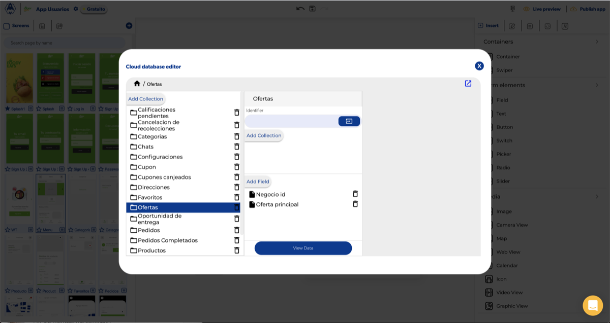
2. En el evento **OnLoad** de la pantalla agrega **Get database data** y activa **Is real time**.
   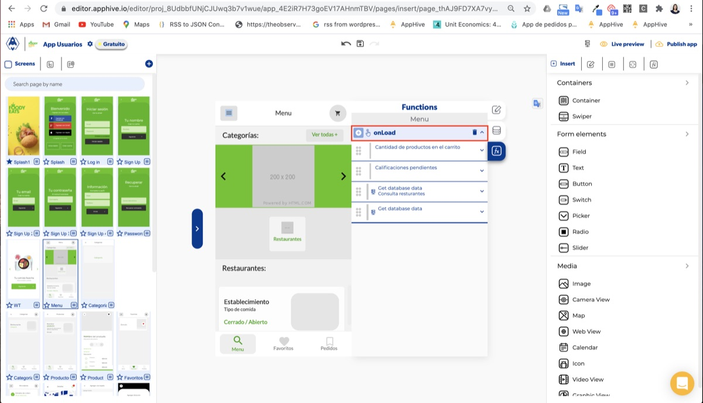
   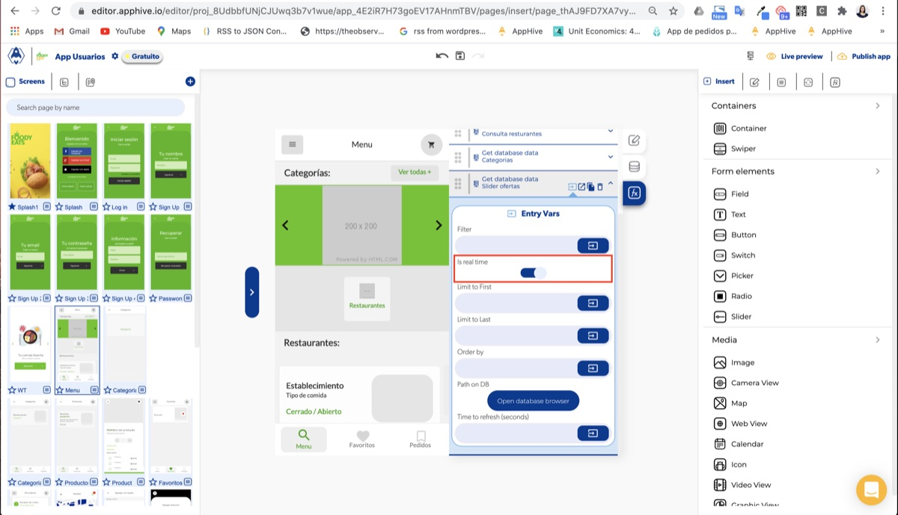
3. Con el botón **Open database browser** elige la colección que creaste (Ofertas).
   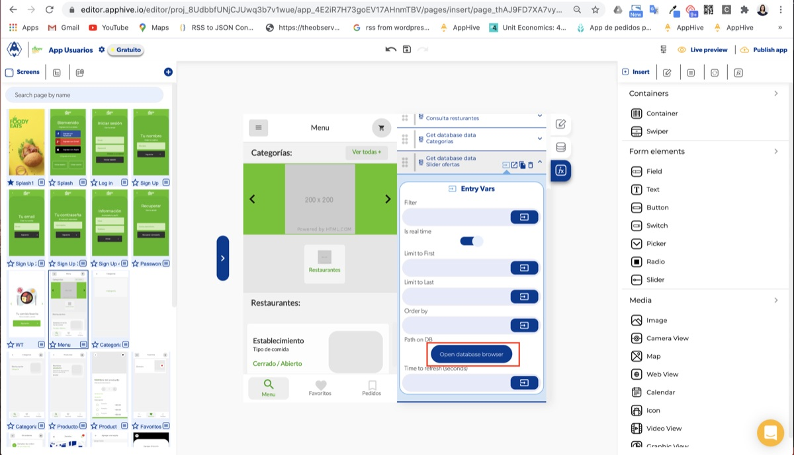
   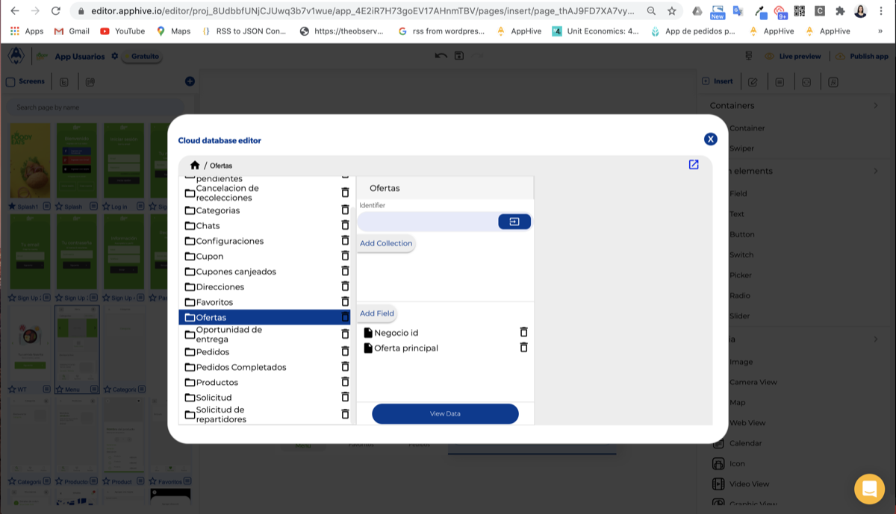
4. En **Callbacks > Data obtained** agrega un **Modify control**:
    - **Data to send**: Get database data + `0.Oferta principal`.
    - **Element**: la imagen `banner1`.
    - **Propiedad**: `src`.

   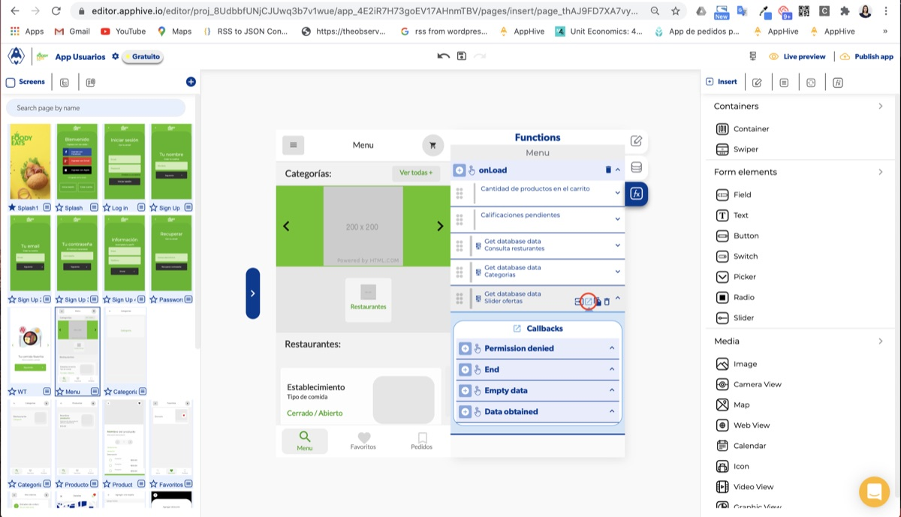
   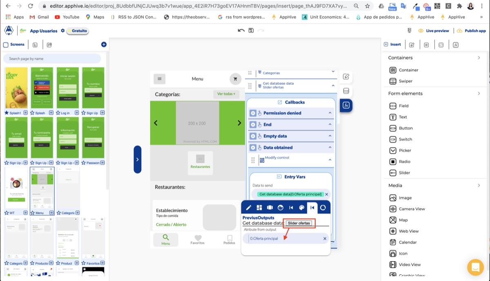
   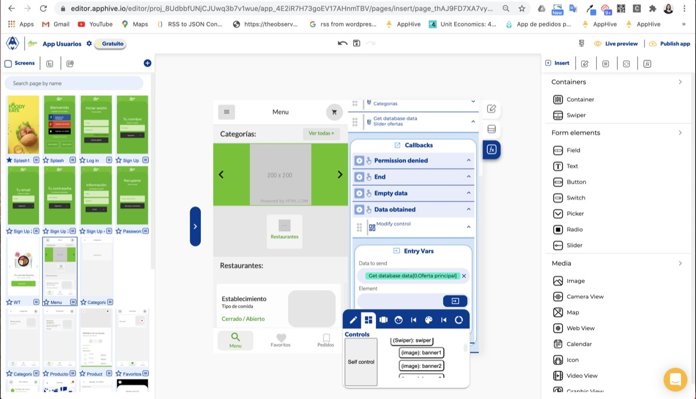
   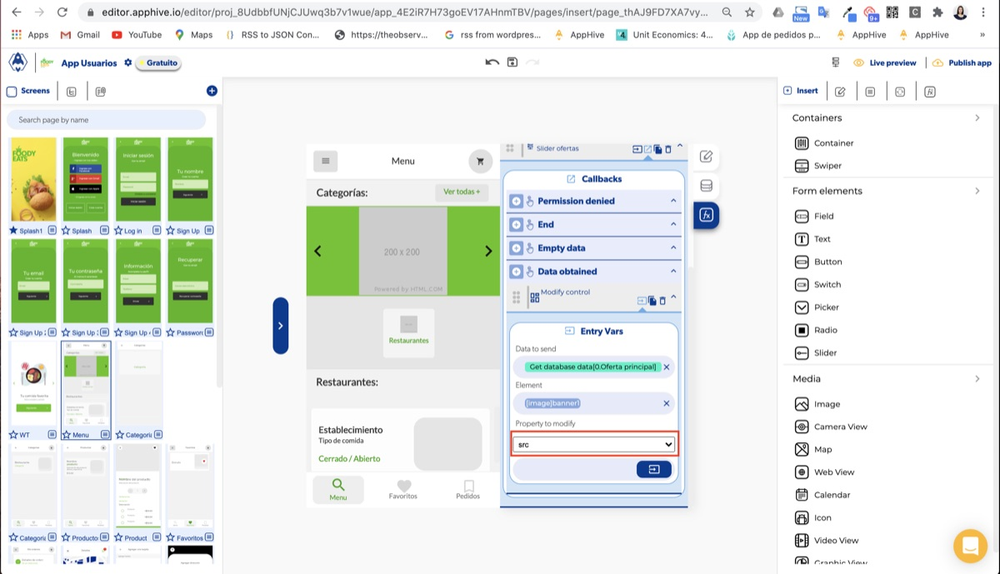
5. Repite el Modify control por cada banner: `banner2` con `1.Oferta principal`, `banner3` con `2.Oferta principal`, etc.
   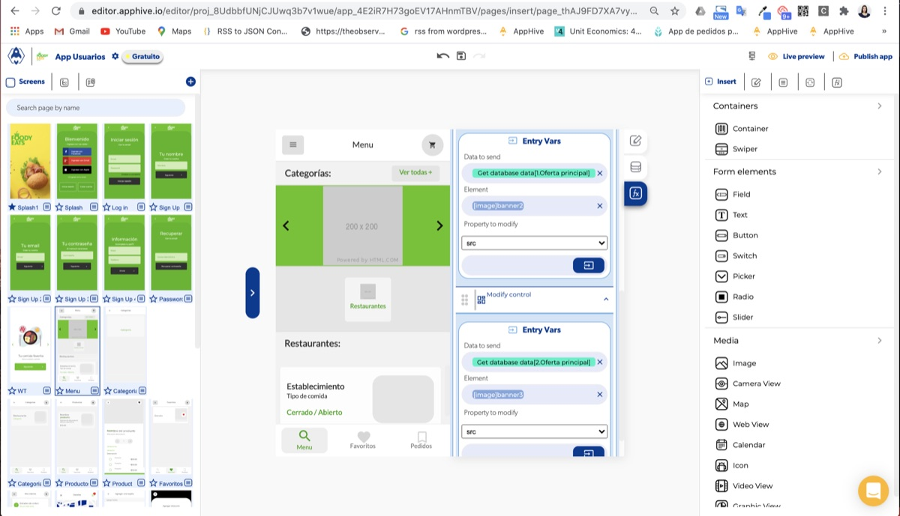
6. Si al tocar un banner quieres saber de qué negocio es, crea en **Context data** las variables de página *Negocio 1*, *Negocio 2*, *Negocio 3* y, en el mismo callback **Data obtained**, guarda cada id con **Set page value** (Key: *Negocio 1*, Value: PreviusOutputs > `0.Negocio id`; Key: *Negocio 2*, Value: `1.Negocio id`, etc.).
   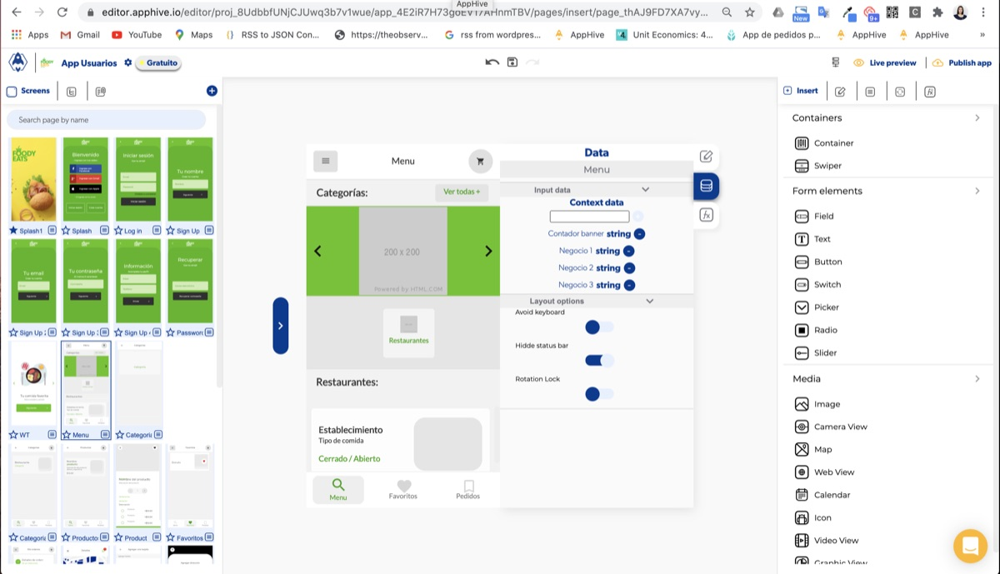
   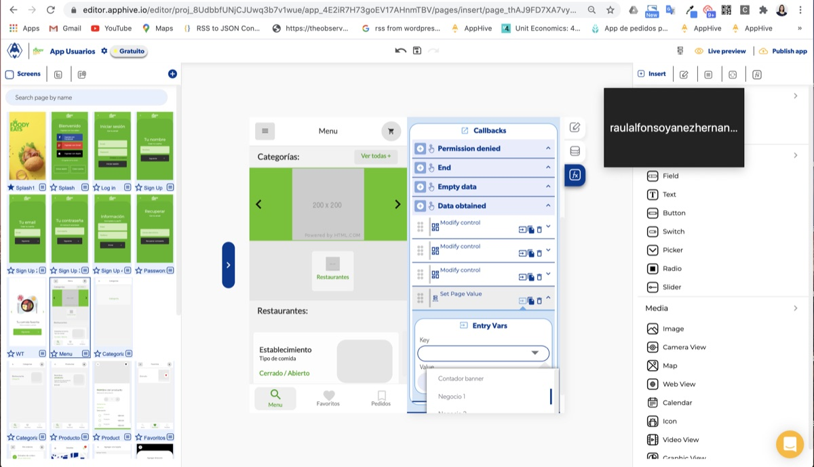
   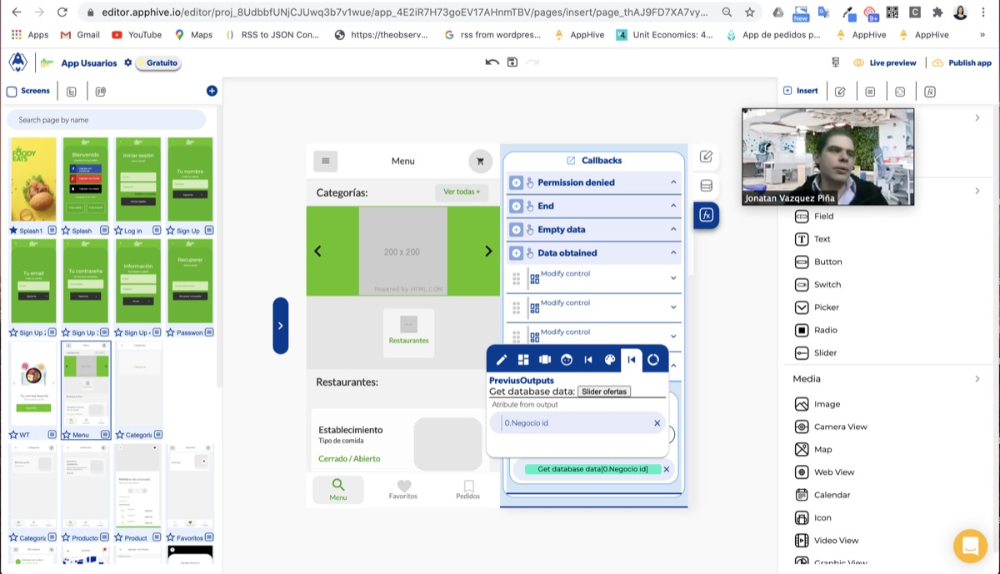

!!! note

    Las promociones se cargan desde la base de datos y no desde la app del negocio a propósito: así puedes revisar qué se publica antes de que aparezca en el slider.

## Problemas comunes

- **El slider no se ve**: revisa que cada imagen tenga ancho y alto, que la opción Contain esté activa y que la propiedad que cambias con Modify control sea `src`.
- **Quiero un texto animado como el del ejemplo**: el texto parpadeante del ejemplo es un GIF; puedes crear uno con un generador de GIF y usarlo como imagen.
