# Compilar versión en TestFlight

Para compilar tu app iOS y subirla a TestFlight, Apphive te pide los datos de una **API Key de App Store Connect**: el **Key ID**, el **Issuer ID** y el archivo **.p8**. Además, debe existir el **contenedor de tu app** en App Store Connect; mientras no exista, la compilación queda incompleta.

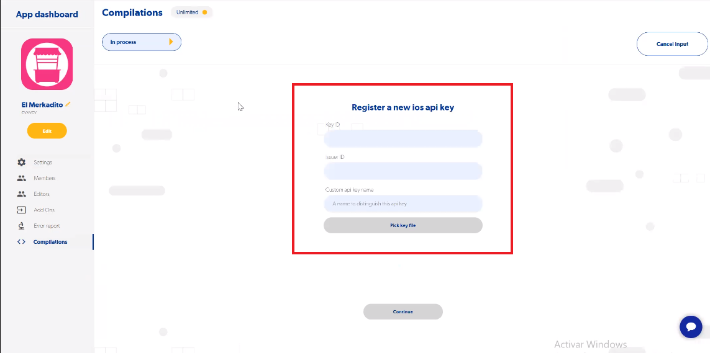

## 1. Crear la API Key en App Store Connect

1. Entra a [https://appstoreconnect.apple.com/](https://appstoreconnect.apple.com/).
2. Da clic en **Usuarios y accesos**.
   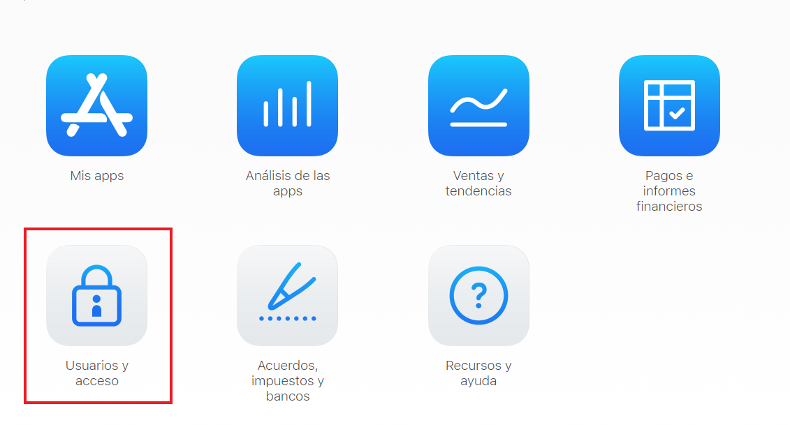
3. Selecciona la pestaña **Keys** (o **Claves**, según tu idioma).
   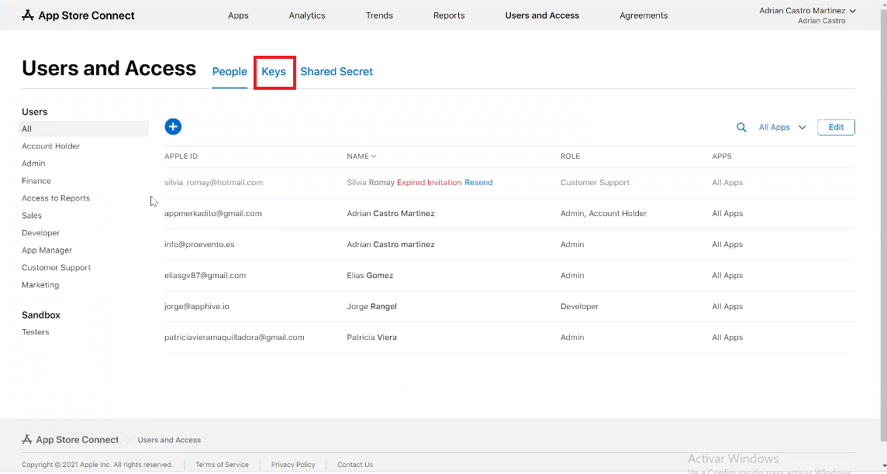
4. Verifica que estés en **App Store Connect API** y da clic en **Request Access**.
   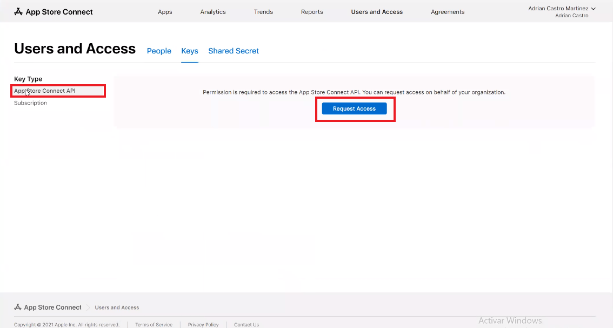
5. Marca la casilla para aceptar compartir tus API Keys (así la compilación puede hacerse de forma automática) y da clic en **Enviar**.
   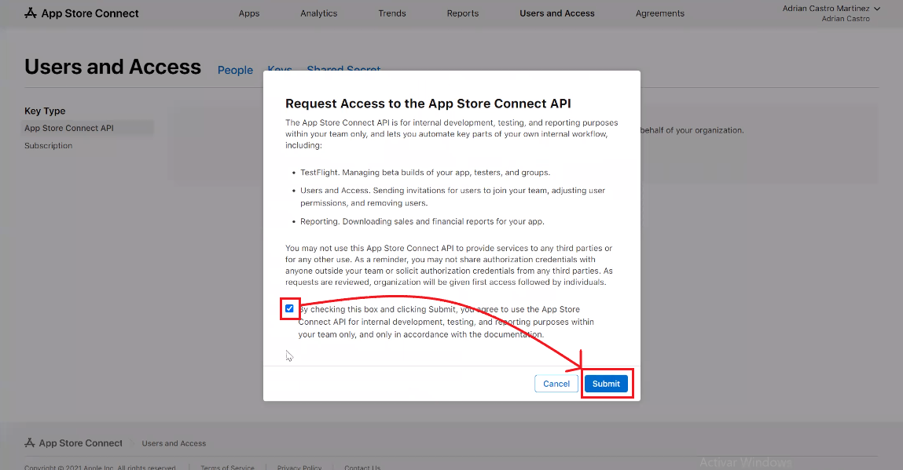
6. Da clic en **Generate API Key**.
   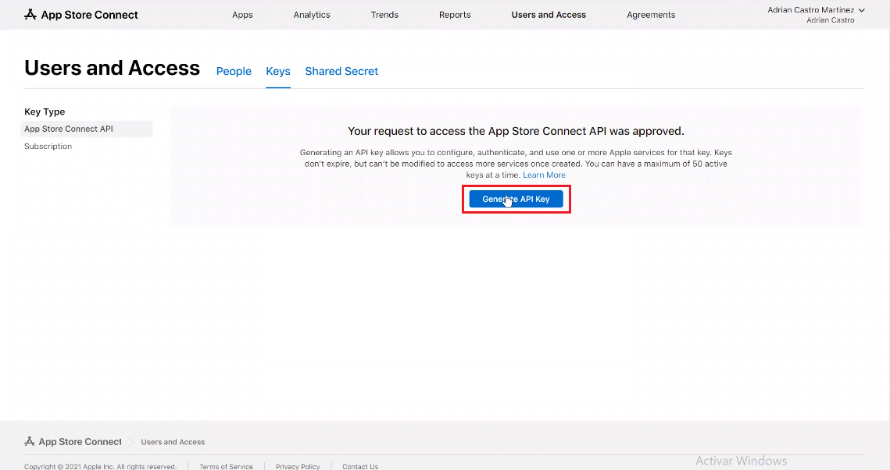
7. Ponle cualquier nombre y en **Access** selecciona **Admin**.
   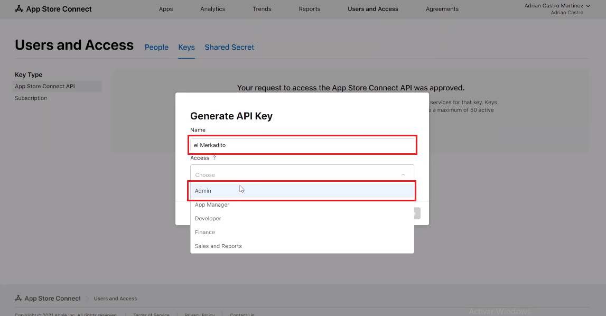
8. Da clic en **Generate**.
   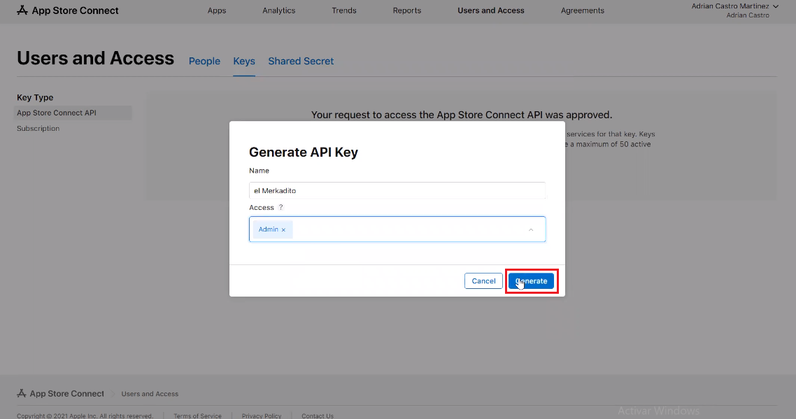
9. Da clic en **Download API Key** y luego en **Download**. Se descarga un archivo **.p8**: guárdalo donde puedas encontrarlo fácilmente.
   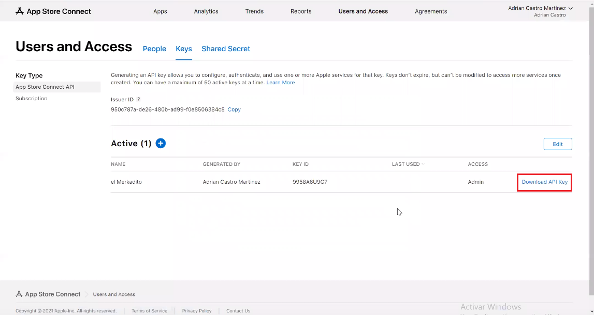
   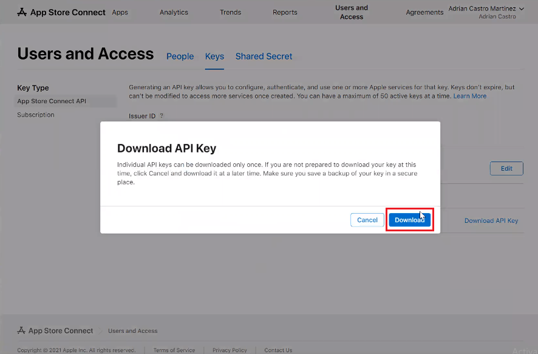

## 2. Cargar la API Key en Apphive

1. Ya tienes los tres datos que pide la compilación: **Key ID**, **Issuer ID** y el **archivo .p8**.
   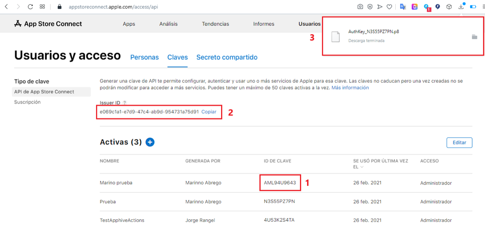
2. Copia el **Key ID** y el **Issuer ID** en el editor.
3. En **Custom api key name** escribe un nombre que te permita identificar la clave. Puede ser cualquiera; sirve para que, al compilar otros proyectos, no tengas que volver a cargar todos los campos.
4. Da clic en **Pick key file**, selecciona el archivo .p8 y da clic en **Abrir**.
   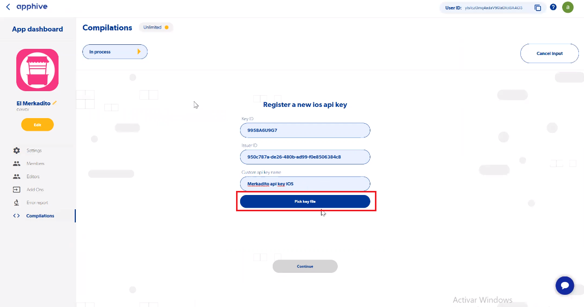
   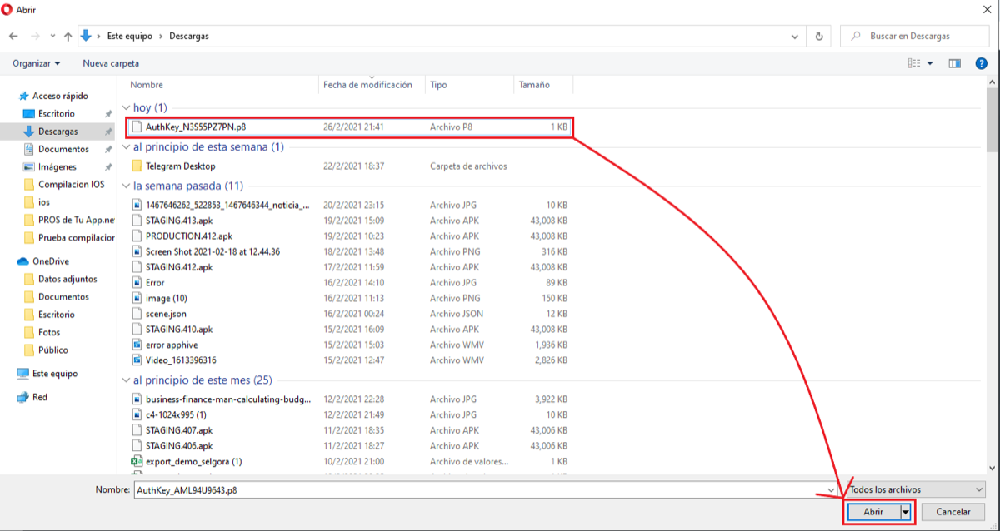
5. Da clic en **Continuar**.
   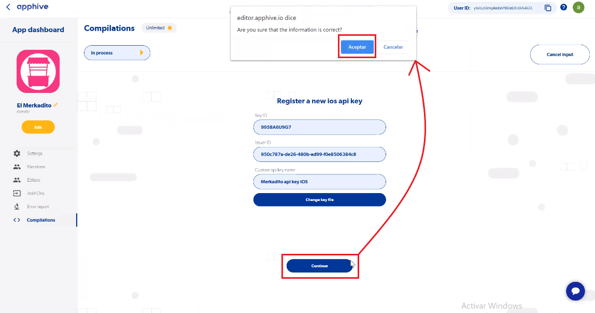

Si todavía no existe el contenedor de tu app en App Store Connect, Apphive te avisará que debes crearlo.

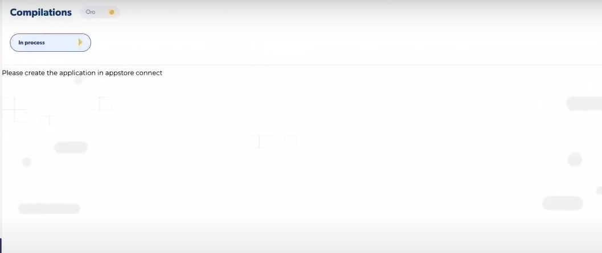

## 3. Crear el contenedor de la app en App Store Connect

1. Entra a [https://appstoreconnect.apple.com/](https://appstoreconnect.apple.com/) y da clic en **Mis Apps**.
   
2. Da clic en el botón **Agregar** y en **Nueva app**.
   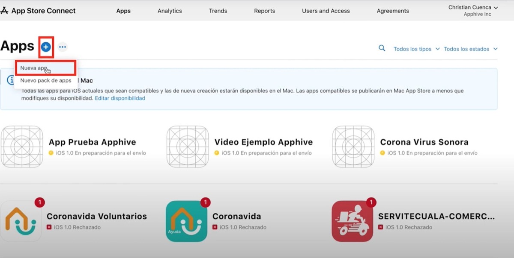
3. Selecciona **iOS**, escribe el nombre de la app y elige su idioma principal.
   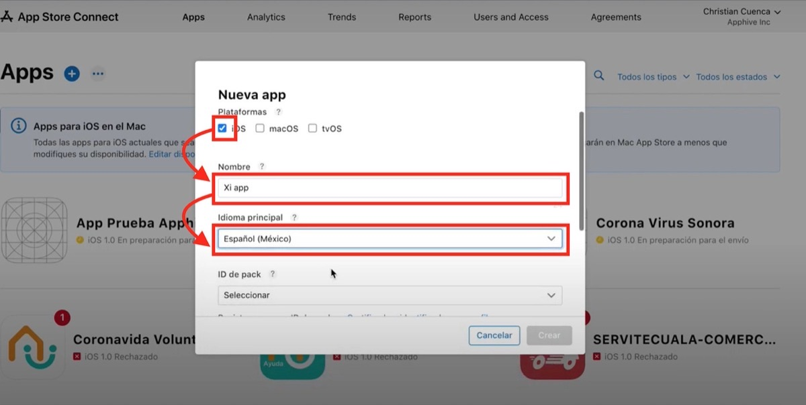
4. En **ID de pack** (Bundle ID) selecciona el **Compilation ID** de tu app, por ejemplo `io.apphive.clientapps.userapp`.
   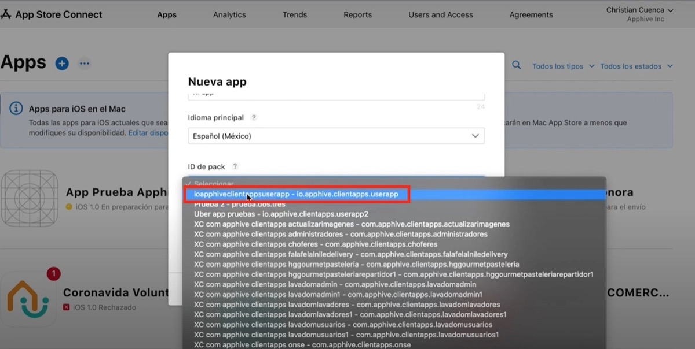
5. Escribe el mismo Compilation ID en **SKU**, selecciona **Acceso ilimitado** y da clic en **Crear**.
   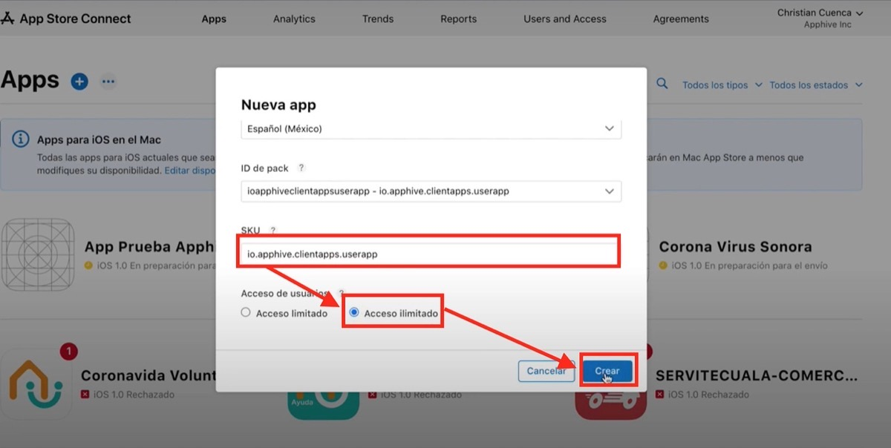

## 4. Reanudar la compilación

Cuando el contenedor exista, si la compilación no cambia de estado da clic en **CANCEL INPUT** y elige la opción de recargar. En ese momento la compilación comienza.

Si tu app usa notificaciones push, configura también la clave de APNs en Firebase: [Crear key para habilitar Push Notification en Firebase](crear-key-para-habilitar-push-notification-en-firebase.md).
