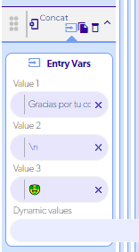

# Concatenar con un salto de línea

Para unir dos textos con un salto de línea entre ellos, escribe `\n` en el punto donde quieres que empiece la nueva línea.

## Ejemplo

Si guardas en una variable de página las oraciones que va escribiendo el usuario y las muestras debajo de un campo de texto, al agregar una nueva oración concatena:

1. El texto que ya tenías guardado.
2. `\n`
3. La nueva oración.

El resultado se mostrará en dos líneas.

Consulta los parámetros de la función en la referencia de [Concat](../reference/funciones/logic-e/concat/README.md).
