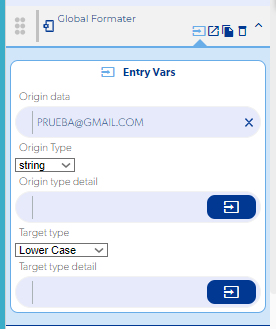

# El correo electrónico siempre aparece con la primera letra en mayúscula

Que el teclado escriba en mayúscula la primera letra del correo no afecta el funcionamiento: el inicio de sesión acepta el correo igual, lo escriba el usuario con mayúscula o con minúscula. Si quieres asegurarte de que siempre se guarde en minúsculas, conviértelo con la función **Global Formater**.

## Convertir el correo a minúsculas

Antes de enviar o guardar el correo, pásalo por [Global Formater](../reference/funciones/logic-e/global-formater/README.md) con la configuración para convertir todo el texto a minúsculas, y usa la salida de esa función en lugar del valor del campo.

!!! note "¿Se puede abrir el teclado en minúscula?"
    No. Que el teclado empiece con mayúscula lo decide el sistema operativo del teléfono, no la app.
