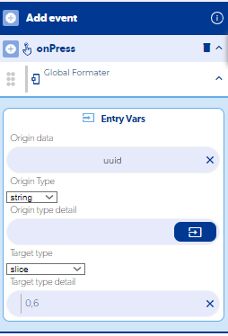

# Crear IDs de usuario personalizados

Puedes crear IDs legibles como `Usuario1`, `Usuario2`… leyendo cuántos usuarios hay guardados, sumándole 1 y concatenando el resultado a la palabra `Usuario`. Si solo necesitas un ID más corto, la opción más segura es recortar el ID aleatorio que ya tiene cada usuario.

!!! warning "Por qué se usa un ID aleatorio"
    Un ID consecutivo depende de leer el último número guardado. Si dos usuarios se registran al mismo tiempo, ambos pueden leer el mismo número y quedar con el mismo ID. El ID aleatorio evita esa coincidencia.

## Opción 1: acortar el ID aleatorio

Usa un formateador con **slice** sobre el ID del usuario para quedarte solo con los primeros caracteres. Por ejemplo, `0,6` toma los primeros 6 caracteres; `0,8`, los primeros 8.

## Opción 2: ID consecutivo (Usuario1, Usuario2…)

1. Registra al usuario.
2. Consulta con **Get database data** la tabla donde guardas la información de tus usuarios (puede repetir los datos de la base de usuarios).
3. Si la consulta se va por **Empty**, es el primer usuario: guarda el registro con el identificador `Usuario1`.
4. Si la consulta se va por **Data obtained**:
    1. Convierte el objeto en arreglo.
    2. Obtén la longitud del arreglo y súmale 1.
    3. Con **Concat**, une `Usuario` + el resultado.
    4. Guarda el registro con **Save in DB** usando como *identifier* el valor concatenado.

El resultado será `Usuario1`, `Usuario2`, `Usuario3`…

### ¿Y si quiero ceros a la izquierda (Usuario0001)?

Necesitas lógica adicional: obtén cuántos dígitos tiene el número y, con un **Switch**, antepón los ceros que falten:

| Dígitos del número | Concatenar |
| --- | --- |
| 1 | `Usuario000` + número |
| 2 | `Usuario00` + número |
| 3 | `Usuario0` + número |

!!! note
    Como no sabes cuántos usuarios tendrás, al superar la cantidad de dígitos prevista los IDs quedarán desfasados (por ejemplo, `Usuario0001` junto a `Usuario000001`). Si no necesitas los ceros, deja el formato `Usuario1`, `Usuario2`… y nunca tendrás que cambiar la lógica.
